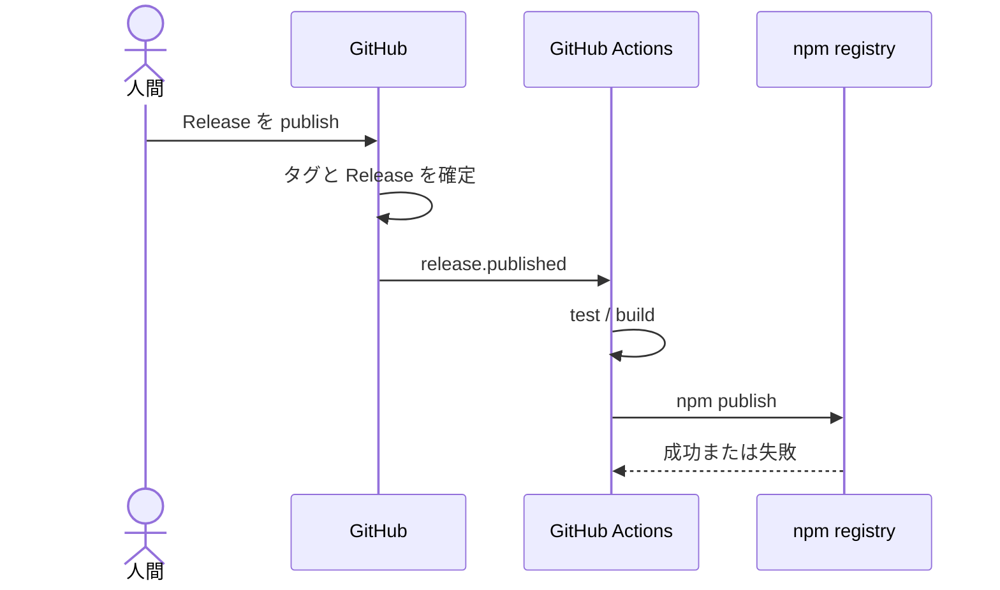
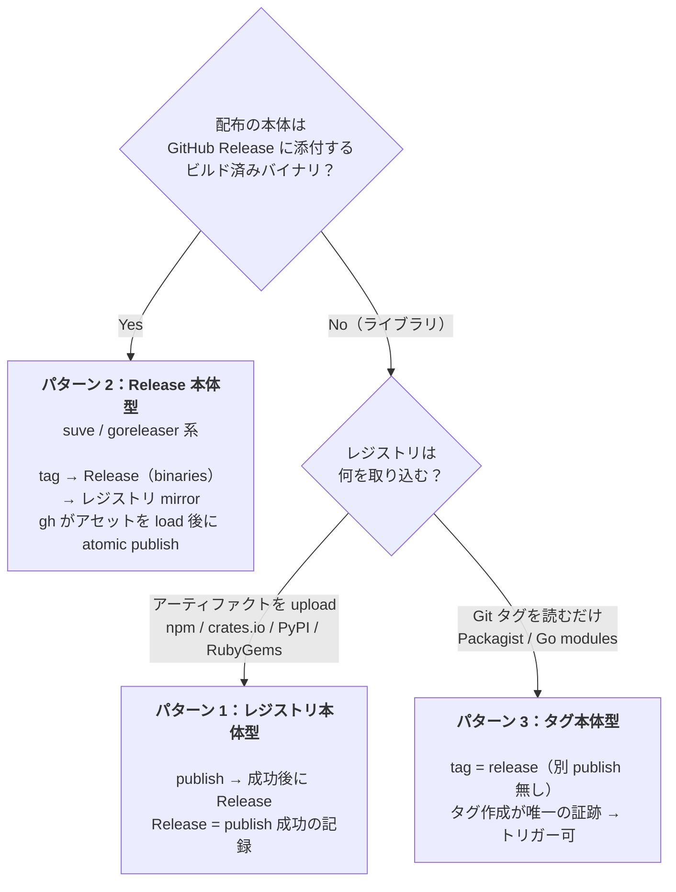
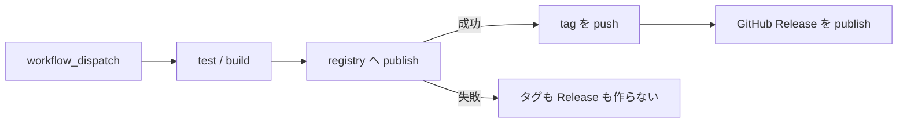
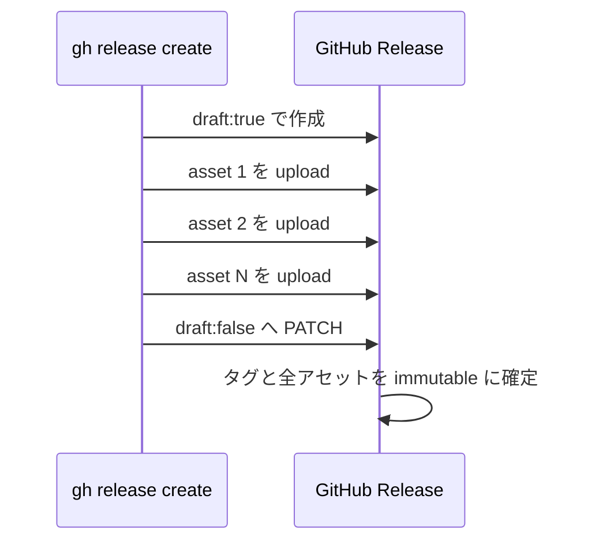

# はじめに

GitHub Actions からパッケージを公開するとき，こんなワークフローを組んでいないでしょうか？

> GitHub 上で Release を作成する
> → `on: release: types: [published]` でワークフローが起動する
> → `npm publish` が走る

操作する側から見ると，非常に分かりやすいですよね。Release を作れば npm にも公開される。GitHub Release を起点として，その後ろにパッケージレジストリへの publish をぶら下げる構成です。

ところが，2025 年に GitHub の **Immutable Releases（イミュータブルリリース）** が登場したことで，この順序は無視できないリスクを抱えるようになりました。2025 年 8 月のパブリックプレビューを経て，2025 年 10 月には一般提供（GA）されています。

:::message alert
**イミュータブルなタグ / Release は，「カノニカルなリリース行為が成功した瞬間」に焼け。それより前に焼いてはならない。**

とくに npm / crates.io / PyPI / RubyGems のようにレジストリへ成果物をアップロードするライブラリでは，**GitHub Release 作成を publish のトリガーにするな！先に publish を成功させてから，タグと Release を確定せよ。**
:::

ただし，何でもかんでも「publish → Release」にすればいいわけではありません。正しい順序は，**カノニカル（正典）な成果物がどこに在るか** によって 3 パターンに分かれます。

- レジストリ上の tarball・crate・wheel・gem が本体なのか？
- GitHub Release に添付するビルド済みバイナリが本体なのか？
- Git タグそのものがリリースなのか？

この記事では，まず従来の定番構成がなぜ Immutable Releases と衝突するのかを確認し，その後で 3 パターンそれぞれの正しい順序を整理します。

**対象読者: GitHub Actions で npm / crates.io / PyPI / RubyGems へパッケージを公開している方，GoReleaser などでバイナリを配布している方，Packagist / Go modules のリリースフローを設計している方**

# 従来のパターン：Release 作成をトリガーにする

まずは，長らく定番だった構成を見てみましょう。

```yaml
# .github/workflows/publish.yml
name: Publish

on:
  release:
    types: [published]

jobs:
  publish:
    runs-on: ubuntu-latest
    permissions:
      contents: read
      id-token: write
    steps:
      - uses: actions/checkout@v4
      - uses: actions/setup-node@v4
        with:
          node-version: 22
          registry-url: https://registry.npmjs.org
      - run: npm ci
      - run: npm test
      - run: npm publish
```

GitHub 上で Release を publish すると `release.published` イベントが発生し，テスト・ビルド・`npm publish` が順番に実行されます。これを時系列にすると，以下のようになります。



問題点が見えたでしょうか？ **タグと Release が，実際の公開よりも先に確定しています。** `npm publish` の成功はまだ保証されていないのに，GitHub 上では既に「このバージョンをリリースした」という記録が完成しているのです。

テストも通る，ネットワークも安定している，認証設定も正しい，レジストリも健康。そんな平時には何も困りません。しかしリリース設計の良し悪しが問われるのは，だいたい何かがコケたときです。

# なぜ今まで許容されてきたのか？

従来の構成にも順序のズレはありました。それでも広く使われてきたのは，**失敗した状態を消してやり直せたから** です。

publish が失敗する原因はいくらでもあります。

- npm レジストリの障害・レートリミット
- `NPM_TOKEN` の失効・権限不足
- `version` が既存のバージョンと重複
- ネットワークの瞬断
- テスト・ビルドの失敗
- 2FA / OIDC の設定ミス

たとえば `v1.2.3` の Release を作った後で `npm publish` が失敗したとします。npm には `v1.2.3` が存在しないのに，GitHub にはタグと Release だけが残りました。実態と記録が食い違っています。

しかし，これまでは次のように戻せました。

```bash
# 失敗した Release とタグをまとめて削除
gh release delete v1.2.3 --cleanup-tag

# 原因を直した後で同じバージョンを作り直す
gh release create v1.2.3 --generate-notes
```

要するに，間違った Release とタグを消して，**何も起きなかったことにできた** わけです。先に記録を作る設計上の弱点を，「消してやり直す」という運用上の逃げ道が覆い隠していました。

この逃げ道を塞ぐのが Immutable Releases です。

# Immutable Release 時代に何が変わったのか

Immutable Releases を有効化すると，公開済み Release のタグとアセットが凍結されます。また，署名付きのリリースアテステーションも自動生成されます。設定はリポジトリ単位または組織単位で有効化できます。

ここでは，**何が凍結されて，何が編集できるのか** を正確に切り分けておきましょう。

| 対象 | published 後の扱い |
|:---|:---|
| **タグ** | 移動・削除不可 |
| **アセット（添付ファイル）** | 追加・変更・削除不可 |
| **リリースアテステーション** | 署名付きで自動生成 |
| **本文（notes）** | 編集可能 |
| **タイトル** | 編集可能 |

:::message
Immutable Releases が凍結するのは **タグとアセット** です。公開後に誤字を見つけても，Release の本文やタイトルは編集できます。「一度 publish したら説明文まで一文字も触れない」という機能ではありません。
:::

そして今回もっとも重要なのが，タグ名の再利用に関する仕様です。

:::message alert
**一度 Immutable Release を削除しても，そのタグ名は二度と再利用できません。リポジトリ自体を削除し，同じ名前で作り直しても再利用不可です。**
:::

これは「リポジトリ復活攻撃（repository resurrection attack）」を防ぐための意図的な仕様です。攻撃者に過去のリリースと同じ名前を再利用させないという意味では，非常に筋が通っています。

しかし，リリースフローの設計者にとっては前提がひっくり返ります。`gh release delete v1.2.3 --cleanup-tag` で消しても，`v1.2.3` は新品には戻りません。**一度焼いたタグ名は，もう焼き直せない。** この制約を前提として，取り返しのつかない操作をどの瞬間に置くか考え直さなければなりません。

# 破綻シナリオ：Release 先行構成が詰む瞬間

では，Immutable Releases を有効化したリポジトリで，従来の `release.published` 起点を使うと何が起きるでしょうか？

1. `v1.2.3` の Release を publish する。
2. タグ `v1.2.3` と Release がイミュータブルに焼かれる。
3. `release.published` を受けて GitHub Actions が起動する。
4. `npm publish` が npm レジストリの障害で失敗する。
5. npm には `v1.2.3` が存在しない一方で，GitHub には `v1.2.3` のタグと Release が残る。

ここで原因が一時的な障害だったとしても，もう同じ手順をやり直せません。

- Release を削除して `v1.2.3` を作り直す → **タグ名を再利用できない**
- タグを削除してもう一度 push する → **タグを削除できない**
- アセットや別の成果物を後から補う → **アセットを追加・変更できない**
- `v1.2.4` に進む → npm に何も公開していないのに，`v1.2.3` が永久欠番になる

**publish に失敗しただけなのに，バージョン番号を 1 つ焼き払う。** これはレジストリ障害へのペナルティとして，あまりにも重すぎます。

問題の本質は Immutable Releases そのものではありません。Immutable Releases は，完成したリリースを改ざんから守るための機能です。問題なのは，**まだカノニカルな成果物が完成していないのに，先に「完成した」という記録を焼いてしまった順序** にあります。

# 正しい順序は「成果物がどこにあるか」で決まる

では，必ず `npm publish` を最初に置けば解決するのでしょうか？ここで話を雑に一般化してはいけません。

最初に確認すべきなのは，**配布の本体が GitHub Release に添付するビルド済みバイナリかどうか** です。ここを起点にすると，リリースフローはきれいに 3 パターンへ分類できます。



一覧にすると，以下のようになります。

| # | パターン | 代表レジストリ | カノニカル成果物の在処 | 順序 | タグを焼く瞬間 |
|:--|:--|:--|:--|:--|:--|
| 1 | レジストリ本体型 | npm / crates.io / PyPI / RubyGems | レジストリ上の tarball・crate・wheel・gem | publish → Release | publish 成功後 |
| 2 | Release 本体型 | GitHub Release（+ brew / scoop / npm mirror） | GitHub Release のバイナリ | Release(binaries) → mirror | gh の atomic publish |
| 3 | タグ本体型 | Packagist / Go modules | Git タグ（＝リポジトリ） | tag = release | タグ push＝リリース |

「GitHub Release を先に作るな」という標語だけを覚えるのではなく，**カノニカルな成果物が何なのか** を見極めてください。ここからは，各パターンを掘り下げていきます。

## パターン 1：レジストリ本体型（npm / crates.io / PyPI / RubyGems）

npm / crates.io / PyPI / RubyGems では，レジストリが tarball・crate・wheel・gem という成果物の本体をホストします。

- npm なら `npm publish`
- crates.io なら `cargo publish`
- PyPI なら `twine upload`
- RubyGems なら `gem push`

これらは単なる通知ではありません。**成果物をレジストリへアップロードする行為そのものが，カノニカルなリリース行為** です。したがって，GitHub Release はその成功に追従する記録として扱うべきです。

正しい順序は，次のとおりです。



`workflow_dispatch` から起動し，まず publish する。成功した場合に限ってタグを push し，GitHub Release を作ります。publish が失敗すれば後続ステップは実行されないため，同じバージョンで何度でもやり直せます。**イミュータブルなタグを焼くのは，レジストリ上にカノニカルな成果物が存在した後だけ** です。

### GitHub Actions の実装例

npm の Trusted Publishing を使い，`NPM_TOKEN` を置かない構成は次のようになります。

```yaml
# .github/workflows/release.yml
name: Release

on:
  workflow_dispatch:
    inputs:
      version:
        description: "リリースするバージョン（例: 1.2.3）"
        required: true
        type: string

jobs:
  release:
    runs-on: ubuntu-latest
    permissions:
      contents: write
      id-token: write

    steps:
      - uses: actions/checkout@v4
        with:
          fetch-depth: 0

      - uses: actions/setup-node@v4
        with:
          node-version: 22
          registry-url: https://registry.npmjs.org

      - run: npm ci
      - run: npm test
      - run: npm run build

      # 1. カノニカルな成果物を先に公開する
      - name: Publish to npm
        run: npm publish

      # 2. npm publish が成功した後でのみタグを作る
      - name: Create and push tag
        env:
          VERSION: ${{ inputs.version }}
        run: |
          git tag "v$VERSION"
          git push origin "v$VERSION"

      # 3. GitHub Release は publish 成功の記録
      - name: Create GitHub Release
        env:
          GH_TOKEN: ${{ github.token }}
          VERSION: ${{ inputs.version }}
        run: gh release create "v$VERSION" --generate-notes
```

この例の要点は，`npm publish` とタグ作成の間に条件分岐を凝らすことではありません。**単純なステップ順序そのものが安全装置** になっています。`npm publish` が失敗したら，タグ作成にも Release 作成にも到達しません。

:::message
crates.io 自体もイミュータブルです。公開済み crate を yank することはできても，同じバージョンを上書きすることはできません。

つまり crates.io では，**publish こそ取り返しのつかない行為** です。だからこそ，その成功後に GitHub Release を追従させるという順序が，より強く効いてきます。
:::

### npm Trusted Publishing と素直に組み合わせる

npm の **Trusted Publishing（OIDC）** は 2025 年 7 月に一般提供（GA）されました。GitHub Actions の OIDC トークンで一時的に認証するため，長期の `NPM_TOKEN` は不要です。さらに **provenance（来歴証明）も自動付与** されます。

必要な権限は `id-token: write` です。先ほどの例でも，ジョブの `permissions` に明示しています。トークンレスで provenance 付き，しかもカノニカルな publish を先に完了させる。Immutable Releases 時代の npm リリースフローと非常に相性が良い構成です。

:::message alert
npm 側の Trusted Publisher 設定には，**実際に publish ステップを含む再利用ワークフローではなく，起点となったワークフローファイル名を指定してください。**

`workflow_call` で publish を再利用ワークフローへ切り出しても，OIDC クレームに入るのは呼び出し「元」のファイル名です。ここを取り違えると設定が噛み合いません。publish ジョブを独立した `workflow_dispatch` にしておくと，npm 側へ登録するファイルと実際の起点が一致し，設計が素直になります。
:::

## パターン 2：Release 本体型（バイナリツール）

次は，コンパイル済みバイナリを GitHub Release のアセットとして配るツールです。私が開発している `mpyw/suve` も，このパターンに該当します。

ここでは GitHub Release に添付された darwin / linux / windows 向けバイナリこそが配布の本体です。npm / Homebrew / Scoop は，Release のアーカイブをダウンロードして再パッケージする二次的なミラーにすぎません。そこでビルドし直すわけではありません。

すると，カノニカルな成功地点もパターン 1 とは変わります。

> **tag → GitHub Release（binaries）→ 各レジストリへ mirror**

GitHub Release に全バイナリが揃って publish された時点で，本体のリリースは成功です。タグを焼くべきなのも，この瞬間になります。その後の npm / Homebrew / Scoop への反映は，完成済みのカノニカルな成果物を横へ運ぶ工程です。

### コラム：`gh release create` は一瞬だけ Draft を経由する

ここで，「でも `gh release create` にアセットを渡したら，アップロード完了前に空の Release が publish されるのでは？」と不安になりませんか？

実は `gh release create <assets>` は，`--draft` を明示しなくても内部で必ず次の 3 段階を踏みます。

1. `draft: true` で Release を作成する。
2. アセットをすべてアップロードする。
3. `draft: false` へ PATCH し，Release を publish する。

なぜこんな挙動になっているのでしょうか？理由は，アップロード途中の「アセットが半分しか揃っていない Release」を公開状態で晒さず，公開通知を最後の 1 回だけ発火させるためです。

この順序には，Immutable Releases と組み合わせたときに非常にうれしい性質があります。



**もっともコケやすいアセットアップロードは，まだ Draft の最中に行われます。** イミュータブルなタグが焼かれるのは，全アセットが載り切った後に `draft: false` へ切り替わる一瞬だけです。

つまり，わざわざ手作業で「Draft Release を作る」「アセットを upload する」「Draft を昇格する」という処理を書かなくても，`gh` の標準挙動が **アセット load 後の atomic publish** を実現してくれます。Release 本体型では，これこそが「成功後に焼く」です。

:::message
パターン 1 とパターン 2 では，`gh release create` を置く位置が逆になります。

- パターン 1：レジストリへの publish が本体なので，`gh release create` はその後。
- パターン 2：`gh release create <assets>` によるバイナリ入り Release が本体なので，mirror はその後。

構文ではなく，**何を成功の本体と見なすか** が順序を決めています。
:::

### `mpyw/suve` の実際のリリースフロー

`suve` では役割ごとにワークフローを分離し，すべて `workflow_dispatch` 駆動にしています。`on: release: types: [published]` はどこにも使っていません。

#### `tag.yml`：タグだけを作る

`workflow_dispatch` / `workflow_call` の両方に対応しています。

1. 入力されたバージョン形式を検証する。
2. 同じタグがまだ存在しないことを確認する。
3. タグを作成して push する。

この段階では，まだ Immutable Release は publish されていません。後続のバイナリ作成へ渡す基準点としてタグを用意します。

#### `release.yml`：バイナリ入り Release を作る

こちらも `workflow_dispatch` / `workflow_call` の両方に対応しています。

1. 対象タグが存在することを確認する。
2. GoReleaser で darwin / linux / windows 向けバイナリをビルドする。
3. `gh release create` にアセットを渡し，GitHub Release を作成する。

先ほど説明したとおり，アセットのアップロード中は Draft です。すべて載り切った後の publish で初めて，タグとアセットがイミュータブルに焼かれます。

#### `tag_and_release.yml`：`needs` で束ねる

人間が通常起動するのは，`workflow_dispatch` 専用の `tag_and_release.yml` です。このワークフローが `tag.yml` と `release.yml` を `needs` で連結し，タグ作成後に Release 作成を進めます。

役割は分割しつつ，通常操作では正しい順序を 1 本のフローとして実行できる束ね役です。

#### `release-npm.yml`：完成済み Release を npm へ mirror する

npm への公開は，さらに独立した `release-npm.yml` が担当します。

1. 対象の GitHub Release が存在することを確認する。
2. `gh release download` で Release のアーカイブを取得する。
3. OIDC の Trusted Publishing で `npm publish` する。

ここで npm 用パッケージをゼロからビルドし直すのではなく，**カノニカルな GitHub Release のアーカイブを取得して再パッケージ** します。そのため npm は二次的なミラーという位置付けです。認証はトークンレスで，provenance も自動付与されます。

そして `release-npm.yml` は，あえて `workflow_call` に対応させず **`workflow_dispatch` 専用** にしています。これは単なる好みではありません。

:::message alert
npm Trusted Publishing の OIDC クレームは，publish を実行する再利用ワークフローではなく **起点となったワークフロー名** を参照します。

`release-npm.yml` 自身を独立した `workflow_dispatch` にしておけば，npm 側の Trusted Publisher 設定へ登録するファイル名と，OIDC クレーム上の起点が一致します。パターン 1 で説明した注意点を，ワークフロー構造そのもので回避しているわけです。
:::

`suve` では，タグ作成，バイナリ入り Release 作成，npm への mirror のどれも，Release 公開イベントへ暗黙的に連鎖させていません。**すべて明示的な `workflow_dispatch` から動かし，カノニカルな成果物を確認して次へ進む。** Release 本体型における責務と順序が，そのままワークフロー分割へ現れています。

## パターン 3：タグ本体型（Packagist / Go modules）

最後は，そもそもアップロードすべき別の成果物が存在しないパターンです。

Packagist は GitHub の Webhook を受けると，リポジトリの Git タグを読み，`composer.json` を index します。Go modules も `proxy.golang.org` がタグを見て on-demand に取得します。npm の tarball や PyPI の wheel のような成果物を，開発者が別途 upload する工程はありません。

つまり，この世界では次の 2 つが同義です。

> **タグを打つこと**
> ＝
> **リリースすること**

タグ作成の後ろに，失敗しうる別の publish 工程がありません。記録すべき事実であるリリースと，その記録であるタグが同時に生まれるため，順序がズレようもないのです。

:::message
**このパターンだけは，タグ push を Webhook トリガーにしてよい唯一の例外です。**

「トリガーにしてよい」といっても，タグの後ろで別のカノニカルな成果物を publish するわけではありません。Packagist や Go modules が，既に成立したリリースであるタグを読み取るだけです。
:::

パターン 1 でタグを先に打ってはいけないのは，その後ろに `npm publish` という失敗可能な本番工程が残るからでした。パターン 3 には，その工程自体がありません。だからタグ push がリリースの瞬間であり，その場で焼いて正しいのです。

# 3 パターンを貫く原則

ここまでの話を，1 つの原則に圧縮します。

:::message alert
**イミュータブルなタグ / Release は，「カノニカルなリリース行為が成功した瞬間」に焼け。それより前に焼くな。**
:::

各パターンへ当てはめると，迷いようがありません。

- **パターン 1：レジストリ本体型**
  - カノニカルな行為は，レジストリへの publish。
  - publish 成功後にタグと GitHub Release を焼く。
- **パターン 2：Release 本体型**
  - カノニカルな行為は，バイナリ入り GitHub Release の publish。
  - `gh` が全アセットを load した後，atomic publish の瞬間に焼く。
- **パターン 3：タグ本体型**
  - カノニカルな行為は，タグ作成そのもの。
  - タグ push の場で焼いて正しい。

タイトルの「GitHub Release 作成をパッケージリリースのトリガーにするな！」は，とくにパターン 1 とパターン 2 への戒めです。

パターン 1 では，Release を作った後にレジストリ publish を賭けてはいけません。パターン 2 でも，空または不完全な Release を先に公開して，その後からアセットや mirror の成否を祈ってはいけません。`gh release create <assets>` の Draft 経由を使い，完成したバイナリ入り Release を一度だけ publish してください。

一方でパターン 3 は，タグ作成が唯一のリリース行為です。そこではタグがトリガーになっても，カノニカルな事実と記録の順序は逆転しません。

**何をトリガーにするかから考え始めるのではなく，何が成功したら「リリースできた」と言えるのかから考えてください。** その成功地点にタグと Release を置けば，Immutable Releases は怖い制約ではなく，完成した成果物を守ってくれる強力な仕組みになります。

# まとめ

- GitHub の Immutable Releases は 2025 年 8 月にパブリックプレビュー，2025 年 10 月に GA され，公開済み Release の **タグとアセット** を凍結する
- **Release の本文とタイトルは published 後でも編集可能** であり，凍結対象とは明確に切り分ける必要がある
- 一度 Release を削除してもタグ名は二度と再利用できず，リポジトリを作り直しても戻らない
- `on: release: types: [published]` の後で `npm publish` する構成は，失敗時にバージョン番号を 1 つ焼き払う
- npm / crates.io / PyPI / RubyGems では，**レジストリへの publish を先に成功させ，その後でタグと Release を作れ**
- バイナリツールでは，**`gh release create <assets>` が全アセットを Draft 中に upload し，最後に atomic publish する挙動** を活かせ
- Packagist / Go modules ではタグ作成そのものがリリースなので，タグ push をトリガーにしてよい
- npm Trusted Publishing は長期の `NPM_TOKEN` を不要にし，provenance を自動付与する。ただし **npm 側には起点ワークフローファイル名を設定せよ**
- **イミュータブルなタグ / Release は，カノニカルなリリース行為が成功した瞬間に焼け。それより前に焼くな**

# 参考リンク

https://github.blog/changelog/2025-10-28-immutable-releases-are-now-generally-available/

https://docs.github.com/en/code-security/concepts/supply-chain-security/immutable-releases

https://github.blog/changelog/2025-07-31-npm-trusted-publishing-with-oidc-is-generally-available/

https://docs.npmjs.com/trusted-publishers/

https://docs.npmjs.com/generating-provenance-statements/
