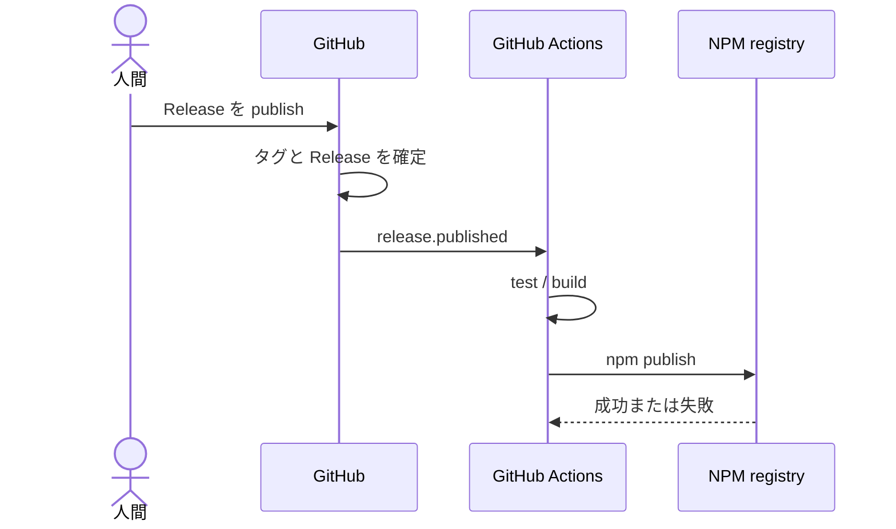
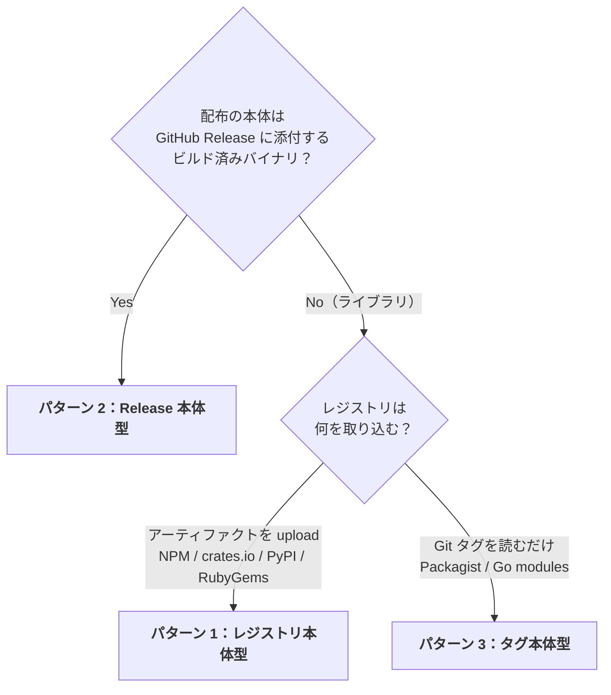
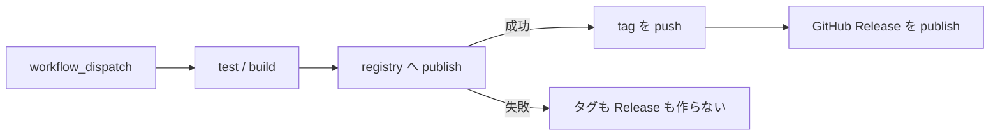
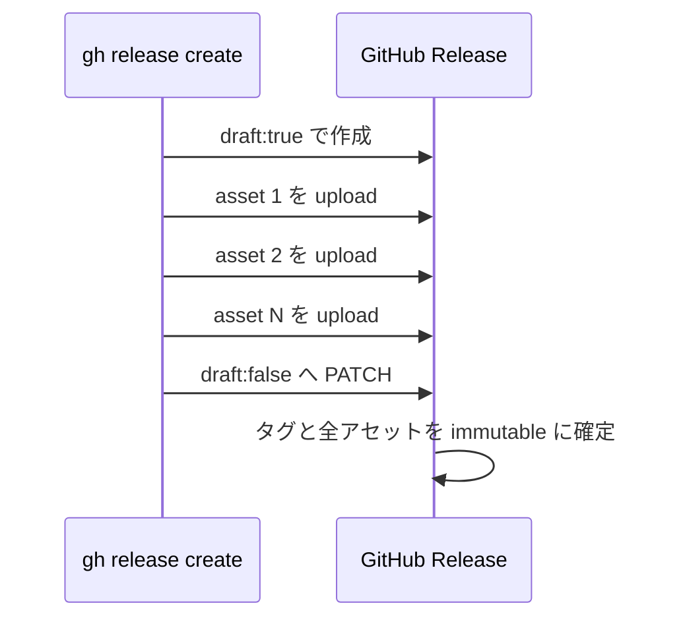

# はじめに

GitHub Actions からパッケージを公開するとき，こんなワークフローを組んでいないでしょうか？

> GitHub 上で Release を作成する
> → `on: release: types: [published]` でワークフローが起動する
> → `npm publish` が走る

操作する側から見ると，非常に分かりやすいですよね。Release を作れば NPM にも公開される。GitHub Release を起点として，その後ろにパッケージレジストリへの publish をぶら下げる構成です。

ところが，2025 年に GitHub の **[Immutable Releases（イミュータブルリリース）](https://github.blog/changelog/2025-10-28-immutable-releases-are-now-generally-available/)** が登場したことで，この順序は無視できないリスクを抱えるようになりました。2025 年 8 月のパブリックプレビューを経て，2025 年 10 月には一般提供（GA）されています。

:::message alert
**イミュータブルなタグ / Release は，「カノニカルなリリース行為が成功した瞬間」に焼け。それより前に焼いてはならない。**

とくに NPM / crates.io / PyPI / RubyGems のようにレジストリへ成果物をアップロードするライブラリでは，**GitHub Release 作成を publish のトリガーにするな！先に publish を成功させてから，タグと Release を確定せよ。**
:::

ただし，何でもかんでも「publish → Release」にすればいいわけではありません。正しい順序は，**カノニカル（正典）な成果物がどこに在るか** によって 3 パターンに分かれます。

- レジストリ上の tarball・crate・wheel・gem が本体なのか？
- GitHub Release に添付するビルド済みバイナリが本体なのか？
- Git タグそのものがリリースなのか？

この記事では，まず従来の定番構成がなぜ Immutable Releases と衝突するのかを確認し，その後で 3 パターンそれぞれの正しい順序を整理します。

**対象読者: GitHub Actions でリリースフローを扱うライブラリやアプリケーションの開発者**

# 従来のパターン：Release 作成をトリガーにする

まずは，長らく定番だった構成を見てみましょう。

```yaml
# .github/workflows/publish.yml
name: Publish

on:
  release:
    types: [published]

jobs:
  publish:
    runs-on: ubuntu-latest
    permissions:
      contents: read
      id-token: write
    steps:
      - uses: actions/checkout@v4
      - uses: actions/setup-node@v4
        with:
          node-version: 22
          registry-url: https://registry.npmjs.org
      - run: npm ci
      - run: npm test
      - run: npm publish
```

GitHub 上で Release を publish すると `release.published` イベントが発生し，テスト・ビルド・`npm publish` が順番に実行されます。これを時系列にすると，以下のようになります。



問題点が見えたでしょうか？ **タグと Release が，実際の公開よりも先に確定しています。** `npm publish` の成功はまだ保証されていないのに，GitHub 上では既に「このバージョンをリリースした」という記録が完成しているのです。

テストも通る，ネットワークも安定している，認証設定も正しい，レジストリも健康。そんな平時には何も困りません。しかしリリース設計の良し悪しが問われるのは，だいたい何かがコケたときです。

# なぜ今まで許容されてきたのか？

従来の構成にも順序のズレはありました。それでも広く使われてきたのは，**失敗した状態を消してやり直せたから** です。

publish が失敗する原因はいくらでもあります。

- NPM レジストリの障害・レートリミット
- `version` が既存のバージョンと重複
- ネットワークの瞬断
- テスト・ビルドの失敗
- MFA / OIDC の設定ミス

たとえば `v1.2.3` の Release を作った後で `npm publish` が失敗したとします。NPM には `v1.2.3` が存在しないのに，GitHub にはタグと Release だけが残りました。実態と記録が食い違っています。

しかし，これまでは次のように戻せました。

```bash
# 失敗した Release とタグをまとめて削除
gh release delete v1.2.3 --cleanup-tag

# 原因を直した後で同じバージョンを作り直す
gh release create v1.2.3 --generate-notes
```

要するに，間違った Release とタグを消して，**何も起きなかったことにできた** わけです。先に記録を作る設計上の弱点を，「消してやり直す」という運用上の逃げ道が覆い隠していました。

この逃げ道を塞ぐのが Immutable Releases です。

# Immutable Release 時代に何が変わったのか

Immutable Releases を有効化すると，公開済み Release のタグとアセットが凍結されます。設定はリポジトリ単位または組織単位で有効化できます。

ここでは，**何が凍結されて，何が編集できるのか** を正確に切り分けておきましょう。

| 対象 | 公開後に変更・削除可能か？ |
|:---|:---:|
| タグ | ❌️ |
| アセット | ❌️ |
| 本文 | ✅️ |
| タイトル | ✅️ |

:::message
Immutable Releases が凍結するのは **タグとアセット** です。公開後に誤字を見つけても，Release の本文やタイトルは編集できます。「一度 publish したら説明文まで一文字も触れない」という機能ではありません。
:::

そして今回もっとも重要なのが，タグ名の再利用に関する仕様です。

:::message alert
**一度 Immutable Release を削除しても，そのタグ名は二度と再利用できません。リポジトリ自体を削除し，同じ名前で作り直しても再利用不可です。**
:::

これは「[リポジトリ復活攻撃（repository resurrection attack）](https://docs.github.com/en/code-security/concepts/supply-chain-security/immutable-releases)」を防ぐための意図的な仕様です。攻撃者に過去のリリースと同じ名前を再利用させないという意味では，非常に筋が通っています。

しかし，リリースフローの設計者にとっては前提がひっくり返ります。`gh release delete v1.2.3 --cleanup-tag` で消しても，`v1.2.3` は新品には戻りません。**一度焼いたタグ名は，もう焼き直せない。** この制約を前提として，取り返しのつかない操作をどの瞬間に置くか考え直さなければなりません。

# 破綻シナリオ：Release 先行構成が詰む瞬間

では，Immutable Releases を有効化したリポジトリで，従来の `release.published` 起点を使うと何が起きるでしょうか？

1. `v1.2.3` の Release を publish する。
2. タグ `v1.2.3` と Release がイミュータブルに焼かれる。
3. `release.published` を受けて GitHub Actions が起動する。
4. `npm publish` が NPM レジストリの障害で失敗する。
5. NPM には `v1.2.3` が存在しない一方で，GitHub には `v1.2.3` のタグと Release が残る。

ここで原因が一時的な障害だったとしても，もう同じ手順をやり直せません。

- Release を削除して `v1.2.3` を作り直す → **タグ名を再利用できない**
- タグを削除してもう一度 push する → **タグを削除できない**
- アセットや別の成果物を後から補う → **アセットを追加・変更できない**
- `v1.2.4` に進む → NPM に何も公開していないのに，`v1.2.3` が永久欠番になる

**publish に失敗しただけなのに，バージョン番号を 1 つ焼き払う。** これはレジストリ障害へのペナルティとして，あまりにも重すぎます。

問題の本質は Immutable Releases そのものではありません。Immutable Releases は，完成したリリースを改ざんから守るための機能です。問題なのは，**まだカノニカルな成果物が完成していないのに，先に「完成した」という記録を焼いてしまった順序** にあります。

# 正しい順序は「成果物がどこにあるか」で決まる

では，必ず `npm publish` を最初に置けば解決するのでしょうか？ここで話を雑に一般化してはいけません。

最初に確認すべきなのは，**配布の本体が GitHub Release に添付するビルド済みバイナリかどうか** です。ここを起点にすると，リリースフローはきれいに 3 パターンへ分類できます。



一覧にすると，以下のようになります。

| # | パターン | 代表レジストリ | カノニカル成果物の在処 | 順序 |
|:--|:--|:--|:--|:--|
| 1 | レジストリ本体型 | NPM<br>crates.io<br>PyPI<br>RubyGems | レジストリ上のアセット | レジストリ → GitHub Release |
| 2 | Release 本体型 | GitHub Release<br>Homebrew<br>Scoop<br>NPM ミラー | GitHub Release 上のアセット | GitHub Release → ミラー |
| 3 | タグ本体型 | Packagist<br>Go modules | Git タグ | タグ = GitHub Release |

「GitHub Release を先に作るな」という標語だけを覚えるのではなく，**カノニカルな成果物が何なのか** を見極めてください。ここからは，各パターンを掘り下げていきます。

## パターン 1：レジストリ本体型（NPM / crates.io / PyPI / RubyGems）

NPM / crates.io / PyPI / RubyGems では，レジストリが tarball・crate・wheel・gem という成果物の本体をホストします。

- NPM なら `npm publish`
- crates.io なら `cargo publish`
- PyPI なら `twine upload`
- RubyGems なら `gem push`

これらは単なる通知ではありません。**成果物をレジストリへアップロードする行為そのものが，カノニカルなリリース行為** です。したがって，GitHub Release はその成功に追従する記録として扱うべきです。

正しい順序は，次のとおりです。



`workflow_dispatch` から起動し，まず publish する。成功した場合に限ってタグを push し，GitHub Release を作ります。publish が失敗すれば後続ステップは実行されないため，同じバージョンで何度でもやり直せます。**イミュータブルなタグを焼くのは，レジストリ上にカノニカルな成果物が存在した後だけ** です。

### GitHub Actions の実装例

`workflow_dispatch` を起点に，**publish → tag → Release の順** で単純にステップを並べるだけです。

```yaml
# .github/workflows/release.yml
on:
  workflow_dispatch:
    inputs:
      version:
        required: true
        type: string

jobs:
  release:
    runs-on: ubuntu-latest
    permissions:
      contents: write
      id-token: write
    steps:
      - uses: actions/checkout@v4
      - uses: actions/setup-node@v4
        with:
          node-version: 22
          registry-url: https://registry.npmjs.org
      - run: npm ci

      # 1. カノニカルな成果物を先に公開する
      - run: npm publish

      # 2. 成功した後でのみタグと Release を作る
      - env:
          GH_TOKEN: ${{ github.token }}
          VERSION: ${{ inputs.version }}
        run: |
          git tag "v$VERSION" && git push origin "v$VERSION"
          gh release create "v$VERSION" --generate-notes
```

`npm publish` が失敗すれば後続には到達しません。**単純なステップ順序そのものが安全装置** です。

## パターン 2：Release 本体型（バイナリツール）

次は，コンパイル済みバイナリを GitHub Release のアセットとして配るツールです。私が開発している `mpyw/suve` も，このパターンに該当します。

https://github.com/mpyw/suve

https://zenn.dev/yumemi_inc/articles/suve-git-like-secret-management

ここでは GitHub Release に添付された darwin / linux / windows 向けバイナリこそが配布の本体です。NPM / Homebrew / Scoop は，Release のアーカイブをダウンロードして再パッケージする二次的なミラーにすぎません。そこでビルドし直すわけではありません。

すると，カノニカルな成功地点もパターン 1 とは変わります。

> **tag → GitHub Release（binaries）→ 各レジストリへミラー**

GitHub Release に全バイナリが揃って publish された時点で，本体のリリースは成功です。タグを焼くべきなのも，この瞬間になります。その後の NPM / Homebrew / Scoop への反映は，完成済みのカノニカルな成果物を横へ運ぶ工程です。

### コラム：`gh release create` は一瞬だけ Draft を経由する

ここで，「でも `gh release create` にアセットを渡したら，アップロード完了前に空の Release が publish されるのでは？」と不安になりませんか？

実は `gh release create <assets>` は，`--draft` を明示しなくても内部で必ず次の 3 段階を踏みます。

1. `draft: true` で Release を作成する。
2. アセットをすべてアップロードする。
3. `draft: false` へ PATCH し，Release を publish する。

なぜこんな挙動になっているのでしょうか？理由は，アップロード途中の「アセットが半分しか揃っていない Release」を公開状態で晒さず，公開通知を最後の 1 回だけ発火させるためです。

この順序には，Immutable Releases と組み合わせたときに非常にうれしい性質があります。



**もっともコケやすいアセットアップロードは，まだ Draft の最中に行われます。** イミュータブルなタグが焼かれるのは，全アセットが載り切った後に `draft: false` へ切り替わる一瞬だけです。

つまり，わざわざ手作業で「Draft Release を作る」「アセットを upload する」「Draft を昇格する」という処理を書かなくても，`gh` の標準挙動が **アセット load 後の atomic publish** を実現してくれます。Release 本体型では，これこそが「成功後に焼く」です。

:::message
パターン 1 とパターン 2 では，`gh release create` を置く位置が逆になります。

- パターン 1：レジストリへの publish が本体なので，`gh release create` はその後。
- パターン 2：`gh release create <assets>` によるバイナリ入り Release が本体なので，ミラーはその後。

構文ではなく，**何を成功の本体と見なすか** が順序を決めています。
:::

### `mpyw/suve` の実際のリリースフロー

`suve` では役割ごとにワークフローを分離し，すべて `workflow_dispatch` 駆動にしています。`on: release: types: [published]` はどこにも使っていません。

#### [`tag.yml`](https://github.com/mpyw/suve/blob/main/.github/workflows/tag.yml)：タグだけを作る

`workflow_dispatch` / `workflow_call` の両方に対応しています。

1. 入力されたバージョン形式を検証する。
2. 同じタグがまだ存在しないことを確認する。
3. タグを作成して push する。

この段階では，まだ Immutable Release は publish されていません。後続のバイナリ作成へ渡す基準点としてタグを用意します。

#### [`release.yml`](https://github.com/mpyw/suve/blob/main/.github/workflows/release.yml)：バイナリ入り Release を作る

こちらも `workflow_dispatch` / `workflow_call` の両方に対応しています。

1. 対象タグが存在することを確認する。
2. GoReleaser で darwin / linux / windows 向けバイナリをビルドする。
3. `gh release create` にアセットを渡し，GitHub Release を作成する。

先ほど説明したとおり，アセットのアップロード中は Draft です。すべて載り切った後の publish で初めて，タグとアセットがイミュータブルに焼かれます。

#### [`tag_and_release.yml`](https://github.com/mpyw/suve/blob/main/.github/workflows/tag_and_release.yml)：`needs` で束ねる

人間が通常起動するのは，`workflow_dispatch` 専用の `tag_and_release.yml` です。このワークフローが `tag.yml` と `release.yml` を `needs` で連結し，タグ作成後に Release 作成を進めます。

役割は分割しつつ，通常操作では正しい順序を 1 本のフローとして実行できる束ね役です。

#### [`release-npm.yml`](https://github.com/mpyw/suve/blob/main/.github/workflows/release-npm.yml)：完成済み Release を NPM へミラーする

NPM への公開は，さらに独立した `release-npm.yml` が担当します。

1. 対象の GitHub Release が存在することを確認する。
2. `gh release download` で Release のアーカイブを取得する。
3. OIDC の Trusted Publishing で `npm publish` する。

ここで NPM 用パッケージをゼロからビルドし直すのではなく，**カノニカルな GitHub Release のアーカイブを取得して再パッケージ** します。そのため NPM は二次的なミラーという位置付けです。認証はトークンレスで，provenance も自動付与されます。

そして `release-npm.yml` は，あえて `workflow_call` に対応させず **`workflow_dispatch` 専用** にしています。これは単なる好みではありません。

:::message alert
NPM Trusted Publishing の OIDC クレームは，publish を実行する再利用ワークフローではなく **起点となったワークフロー名** を参照します。

`release-npm.yml` 自身を独立した `workflow_dispatch` にしておけば，NPM 側の Trusted Publisher 設定へ登録するファイル名と，OIDC クレーム上の起点が一致します。この制約を，ワークフロー構造そのもので回避しているわけです。
:::

`suve` では，タグ作成，バイナリ入り Release 作成，NPM へのミラーのどれも，Release 公開イベントへ暗黙的に連鎖させていません。**すべて明示的な `workflow_dispatch` から動かし，カノニカルな成果物を確認して次へ進む。** Release 本体型における責務と順序が，そのままワークフロー分割へ現れています。

## パターン 3：タグ本体型（Packagist / Go modules）

最後は，そもそもアップロードすべき別の成果物が存在しないパターンです。

Packagist は GitHub の Webhook を受けると，リポジトリの Git タグを読み，`composer.json` を index します。Go modules も `proxy.golang.org` がタグを見て on-demand に取得します。NPM の tarball や PyPI の wheel のような成果物を，開発者が別途 upload する工程はありません。

つまり，この世界では次の 2 つが同義です。

> **タグを打つこと**
> ＝
> **リリースすること**

タグ作成の後ろに，失敗しうる別の publish 工程がありません。記録すべき事実であるリリースと，その記録であるタグが同時に生まれるため，順序がズレようもないのです。

:::message
**このパターンだけは，タグ push を Webhook トリガーにしてよい唯一の例外です。**

「トリガーにしてよい」といっても，タグの後ろで別のカノニカルな成果物を publish するわけではありません。Packagist や Go modules が，既に成立したリリースであるタグを読み取るだけです。
:::

パターン 1 でタグを先に打ってはいけないのは，その後ろに `npm publish` という失敗可能な本番工程が残るからでした。パターン 3 には，その工程自体がありません。だからタグ push がリリースの瞬間であり，その場で焼いて正しいのです。

# 3 パターンを貫く原則

ここまでの話を，1 つの原則に圧縮します。

:::message alert
**イミュータブルなタグ / Release は，「カノニカルなリリース行為が成功した瞬間」に焼け。それより前に焼くな。**
:::

これを依存関係の言葉で捉えるなら，**それ自体で独立して成立する成果物を先に作り，その成果物に依存する記録・派生物を後に作れ** ということです。参照される側が先，参照する側が後。この順序なら，途中で失敗しても存在しない成果物を指す記録は生まれません。

各パターンへ当てはめると，迷いようがありません。

- **パターン 1：レジストリ本体型**
  - カノニカルな行為は，レジストリへの publish。
  - publish 成功後にタグと GitHub Release を焼く。
- **パターン 2：Release 本体型**
  - カノニカルな行為は，バイナリ入り GitHub Release の publish。
  - `gh` が全アセットを load した後，atomic publish の瞬間に焼く。
- **パターン 3：タグ本体型**
  - カノニカルな行為は，タグ作成そのもの。
  - タグ push の場で焼いて正しい。

タイトルの「GitHub Release 作成をパッケージリリースのトリガーにするな！」は，とくにパターン 1 とパターン 2 への戒めです。

パターン 1 では，Release を作った後にレジストリ publish を賭けてはいけません。パターン 2 でも，空または不完全な Release を先に公開して，その後からアセットやミラーの成否を祈ってはいけません。`gh release create <assets>` の Draft 経由を使い，完成したバイナリ入り Release を一度だけ publish してください。

一方でパターン 3 は，タグ作成が唯一のリリース行為です。そこではタグがトリガーになっても，カノニカルな事実と記録の順序は逆転しません。

**何をトリガーにするかから考え始めるのではなく，何が成功したら「リリースできた」と言えるのかから考えてください。** その成功地点にタグと Release を置けば，Immutable Releases は怖い制約ではなく，完成した成果物を守ってくれる強力な仕組みになります。

# 反論：ゴミの場所が入れ替わるだけでは？

以下は，**パターン 1（レジストリ本体型）の「publish → Release」という順序** に向けられる反論と，その回答です。ここまで読んで，こんな反論を思い浮かべた方もいるのではないでしょうか？

> `npm publish` を先に実行しても，その後の GitHub Release 作成が失敗したら，今度は NPM にだけパッケージが残りますよね？結局，ゴミデータが残る場所が GitHub から NPM へ入れ替わるだけでは？
>
> NPM も GitHub もイミュータブルなら，どちらの順序でもリリース途中に失敗したらバージョンを上げるしかないのでは？

鋭い指摘です。まず，この反論が正しい部分から認めましょう。

## これは分散コミット問題である

NPM レジストリと GitHub は，互いに独立した 2 つのイミュータブルなストアです。両方へまたがる一連の操作は，データベースでいう **2 相コミット（2PC）** と同型の問題を抱えています。片方のコミットに成功しても，もう片方のコミットが失敗する可能性を消せません。

そして NPM と GitHub の間には，両方を 1 トランザクションとして確定・ロールバックしてくれるコーディネータが居ません。したがって，**2 系統をまたぐ完全な原子性は原理的に達成できない。** この点において，先ほどの反論は正しいです。

しかし，ここから「ならばゴミの場所が対称に入れ替わるだけ」と結論付けるのは早計です。2 つの不整合状態は，依存関係の向きから見るとまったく対称ではありません。

## 依存の中心（独立した側）を先に作れ

まず，`npm publish` と GitHub Release の間で起こりうる 2 つの状態を並べてみましょう。

- **A：GitHub Release はあるが，NPM には無い**
  - Release が存在しないバージョンを指しています。これは参照先を失った **ダングリング参照** であり，利用者に対する壊れた約束です。
- **B：NPM にはあるが，GitHub Release が無い**
  - 本物のパッケージは既に存在します。成功記録がまだ生成されていないだけの，**良性の未完成状態** です。

NPM ライブラリにおける依存の向きは，**GitHub Release → NPM パッケージ** です。GitHub Release は `npm publish` 成功の記録であり，それ自体で独立して成立するのは NPM パッケージ側です。したがって A と B は，ゴミの置き場所を交換しただけの状態ではありません。

データベースの外部キーを考えてみてください。参照される親行を先に insert し，参照する子行を後から insert しますよね？これは，存在しない親を指すダングリング参照を一瞬たりとも作らないためです。リリースでも同じです。

> **依存関係の中心（それ自体で独立して成立する側）を先に作り，それに依存する記録・派生物を後に作れ。**

前半から使ってきた **カノニカルな成果物** とは，ここでいう **依存の中心（独立した側）** です。同じものを，成果物の正統性と依存関係という別々の角度から呼んでいます。独立した側を先に作れば，途中失敗の行き先は必ず良性の B に限定され，依存整合性を壊しません。

:::message
**「恒久的に拒否されうる操作を先に置く」は，一般原則ではなく補強材料です。** 順序を決めるのは，あくまで依存の向きです。

パターン 1 では，独立した側である `npm publish` が，たまたま恒久的に拒否されうる高分散な操作でもあります。そのため先頭へ置けば，失敗しても何も焼けておらずコストがタダになる，という追加のメリットがあります。

一方でパターン 2 では，カノニカルな `gh release create` こそ独立して成立する側であり，拒否されうる NPM ミラーはそれに依存する派生物として後回しです。「拒否されうる操作を先に置け」というヒューリスティックでは，ここで順序を誤ります。**依存の中心を先に作る** と考えれば，3 パターンすべてを同じ原則で説明できます。
:::

NPM ライブラリでこの依存関係を表に落とすと，位置が一意に決まることが分かります。

| 操作 | 依存関係における役割 | 位置 |
|:---|:---|:---|
| `npm publish` | 独立して成立する成果物（参照される **親**） | **先に作る** |
| `git tag` / `gh release create` | `npm publish` を指す記録（参照する **子**） | **後に作る** |

親である NPM パッケージを先に，子である GitHub Release を後に作る。これだけで，途中で失敗しても行き着く先は，存在しない成果物を指さない良性の状態 B に限定されます。この順序が失敗時に具体的にどう効くのか，2 つの順序を並べて見てみましょう。

### Order A：`npm publish` → tag → Release

この記事が推奨している順序です。

- `npm publish` が失敗した場合
  - まだタグも Release も焼けていません。同じバージョンで再実行できるため，バージョンの bump は不要です。
- `npm publish` が成功し，tag / Release 作成でコケた場合
  - NPM には正しい成果物が存在します。tag と Release を冪等に再実行して追いつかせればよいため，やはり bump は不要です。

この順序は，参照される親である NPM パッケージを先に作り，参照する子である GitHub Release を後に作っています。依存整合性を保ったまま，不可逆な一点を **`npm publish` の成功だけ** に絞れます。それ以降は，安く再実行でき，いつか必ず完了させられるメタデータ操作しか残りません。

NPM に載ったパッケージはゴミではありません。カノニカルなリリース行為に成功して得られた，**本物の成果物** です。GitHub 側の記録が一時的に遅れているだけなので，後から追いつかせれば収束します。

### Order B：Release でタグを焼く → `npm publish`

一方，従来の順序ではどうでしょうか？

- タグと Release をイミュータブルに焼く。
- その後で `npm publish` が，バージョン重複・名前ポリシー・MFA・権限剥奪・サイズ制限などの **恒久的な理由** で拒否される。
- 焼いたタグは戻せず，NPM にも成果物を載せられない。
- バージョンを上げるしかなく，GitHub には **タグの墓標だけが残る**。

こちらは，親である NPM パッケージより先に，子である GitHub Release を焼いています。つまり **存在しない親を指すダングリング参照を，先にイミュータブル化している** のです。

## NPM から GitHub Release を復元できる

Order A の決め手は，単に「GitHub のほうが後から直しやすそう」という感覚論ではありません。**NPM から GitHub Release を復元する，冪等な回復アクションを実際に書ける** ことです。

設計の肝は 3 つあります。

1. **カノニカルな成果物の存在を先に検証する**
   - NPM にそのバージョンが本当に存在すると確認できた場合にしか，Release を作りません。「GitHub に記録だけがあり，NPM には成果物が無い」という逆向きの不整合を再発させない安全弁です。
2. **タグを打つ commit を NPM 自身から復元する**
   - 手軽な方法なら，`npm view <pkg>@<ver> gitHead` から publish 時の HEAD の SHA を取得できます。
   - より堅牢に復元するなら，provenance の SLSA predicate に署名付きで記録されたソース commit を使えます。OIDC Trusted Publishing では provenance が自動付与されるため，**OIDC で publish していたおかげで，回復まで「正典」にできる** わけです。記事前半で説明した provenance が，ここで効いてきます。
3. **すべてを冪等にする**
   - tag は無ければ作り，有れば触らない。Release も無ければ作り，有れば何もしない。何度実行しても同じ完成状態へ収束させます。

### 回復用ワークフロー

たとえば `@mpyw/suve` を対象にするなら，次のような `workflow_dispatch` を用意できます。

```yaml
# .github/workflows/recover-release.yml
name: Recover GitHub Release from npm
run-name: "Recover release for ${{ inputs.version }}"

on:
  workflow_dispatch:
    inputs:
      version:
        description: "既に npm に publish 済みのバージョン（例: 1.2.3）"
        required: true
        type: string
      sha:
        description: "（任意）タグを打つ commit。省略時は npm から復元"
        required: false
        type: string

permissions:
  contents: write

jobs:
  recover:
    runs-on: ubuntu-latest
    steps:
      # 1. カノニカルな成果物が本当に存在するか検証（無ければ回復対象ではない）
      - name: Verify the version exists on npm
        env:
          VERSION: ${{ inputs.version }}
        run: |
          if ! npm view "@mpyw/suve@${VERSION}" version >/dev/null 2>&1; then
            echo "npm に @mpyw/suve@${VERSION} が存在しません。中止します。"
            exit 1
          fi

      # 2. タグを打つ commit を npm 自身（gitHead）から復元
      - name: Resolve source commit
        id: sha
        env:
          VERSION: ${{ inputs.version }}
          INPUT_SHA: ${{ inputs.sha }}
        run: |
          sha="$INPUT_SHA"
          if [ -z "$sha" ]; then
            sha=$(npm view "@mpyw/suve@${VERSION}" gitHead)
          fi
          if [ -z "$sha" ]; then
            echo "commit を特定できません。provenance を確認するか sha を手動指定してください。"
            exit 1
          fi
          echo "sha=$sha" >> "$GITHUB_OUTPUT"

      # 3. Release を冪等に作成（tag は --target で無ければ生成。既存ならスキップ）
      - name: Create release if missing
        env:
          GH_TOKEN: ${{ github.token }}
          VERSION: ${{ inputs.version }}
          SHA: ${{ steps.sha.outputs.sha }}
        run: |
          if gh release view "v${VERSION}" --repo "$GITHUB_REPOSITORY" >/dev/null 2>&1; then
            echo "Release v${VERSION} は既に存在します。何もしません。"
          else
            gh release create "v${VERSION}" \
              --repo "$GITHUB_REPOSITORY" \
              --target "$SHA" \
              --generate-notes
          fi
```

この例では `git tag` ステップを別に書いていません。`gh release create --target <sha>` は，タグが存在しなければ指定した commit にタグを生成するため，tag と Release の回復を 1 本にまとめられます。既に Release が存在すれば何もしないので，失敗後に何度起動しても安全です。

:::message alert
**Order A では，この回復アクションが「NPM には載ったが Release が無い」という状態を，ワンボタンで前へ収束させます。** さらに堅牢な運用では，回復元の SHA を NPM パッケージ自身の署名付き provenance に基づいて確定できます。カノニカルなソース commit から GitHub 側を復元するため，回復経路へ別の commit を紛れ込ませる余地がありません。**OIDC で publish していたおかげで，回復まで「正典」になる** のです。

**Order B では，そもそも同じ回復アクションを書きようがありません。** NPM から恒久的に publish を拒否されたなら，先に焼いたタグの墓標を消す手段が存在しないからです。

参照整合性の言葉に直すと，この回復アクションは NPM という親の `gitHead` / provenance を読み，GitHub Release という子を再構築しています。**子は親のビューとして再生成できますが，親は子から導出できません。** 焼いたタグという子の墓標から，拒否された `npm publish` という親を作り出すことは原理的に不可能です。

したがって，**「回復アクションが書けるかどうか」自体が，2 つの順序にある非対称性の証明** になっています。Order A でだけ回復アクションを書けるのは，親から子を作る正しい依存方向を守っているからです。
:::

## 順序では救えない失敗もある

もちろん，Order A なら何が起きても bump 不要になるわけではありません。**最初の不可逆コミットに成功した後で，中身が実は壊れていたと発覚した** というクラスの失敗は，どちらの順序でもバージョンを上げるしかありません。ここについては，反論が完全に正しいです。

この領域を縮める方法も，DB のトランザクション設計と同じです。**不可逆コミットより前へ落とせる検証は，すべて前へ落とせ。**

- `npm publish --dry-run` 相当の検証を先に実行する。
- ビルドを publish より前に完了させる。
- スモークテストを publish より前に通す。

記事のパターン 2 で説明した `gh release create` も，まさに同じ構造を持っています。失敗しやすいアセットアップロードを Draft 中に済ませ，全アセットが揃った最後の一瞬だけ atomic publish する。これは **検証と失敗可能な処理を `COMMIT` より前へ寄せる** という，まったく同じ原則です。

**依存の中心（独立した側）を先に作り，それに依存する記録を，後続の安価で冪等な回復可能操作にする。** これが主原則です。しかも NPM ライブラリでは，その独立した側がたまたま恒久的に拒否されうる操作でもあるため，先頭へ置けば失敗コストまでタダになります。

100% の原子性は保証できません。しかし，依存整合性を守る Order A は，多くの失敗モードにおいて厳密にマシです。そしてその差は感覚論ではなく，**参照される親を先に作り，参照する子を後に作る** という，DB のトランザクション設計・参照整合性と同じ原則で明確に説明できます。

# まとめ

- GitHub の Immutable Releases は 2025 年 8 月にパブリックプレビュー，2025 年 10 月に GA され，公開済み Release の **タグとアセット** を凍結する
- **Release の本文とタイトルは published 後でも編集可能** であり，凍結対象とは明確に切り分ける必要がある
- 一度 Release を削除してもタグ名は二度と再利用できず，リポジトリを作り直しても戻らない
- `on: release: types: [published]` の後で `npm publish` する構成は，失敗時にバージョン番号を 1 つ焼き払う
- NPM / crates.io / PyPI / RubyGems では，**レジストリへの publish を先に成功させ，その後でタグと Release を作れ**
- バイナリツールでは，**`gh release create <assets>` が全アセットを Draft 中に upload し，最後に atomic publish する挙動** を活かせ
- Packagist / Go modules ではタグ作成そのものがリリースなので，タグ push をトリガーにしてよい
- NPM Trusted Publishing は長期の `NPM_TOKEN` を不要にし，provenance を自動付与する。ただし **NPM 側には起点ワークフローファイル名を設定せよ**
- **カノニカルな成果物＝依存の中心を先に作り，それに依存する記録・派生物を後に作れば，ダングリング参照を防げる**
- **イミュータブルなタグ / Release は，カノニカルなリリース行為が成功した瞬間に焼け。それより前に焼くな**

# 参考リンク

https://github.blog/changelog/2025-10-28-immutable-releases-are-now-generally-available/

https://docs.github.com/en/code-security/concepts/supply-chain-security/immutable-releases

https://github.blog/changelog/2025-07-31-npm-trusted-publishing-with-oidc-is-generally-available/

https://docs.npmjs.com/trusted-publishers/

https://docs.npmjs.com/generating-provenance-statements/
