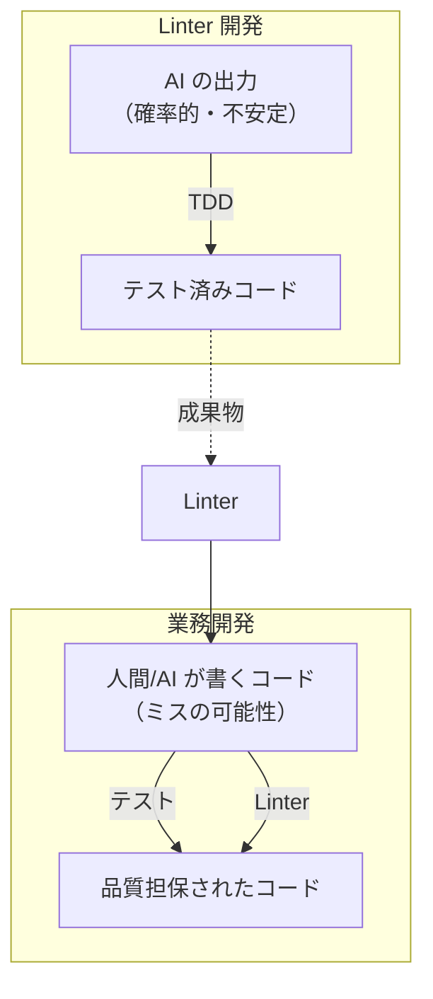
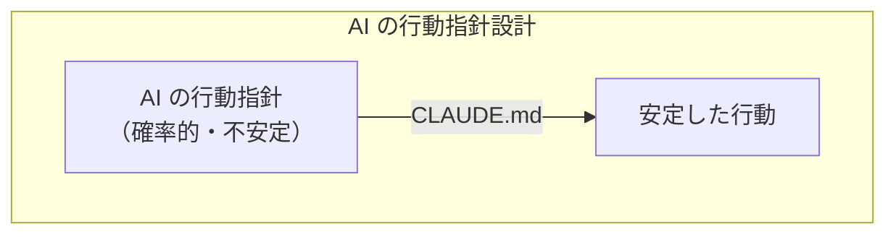
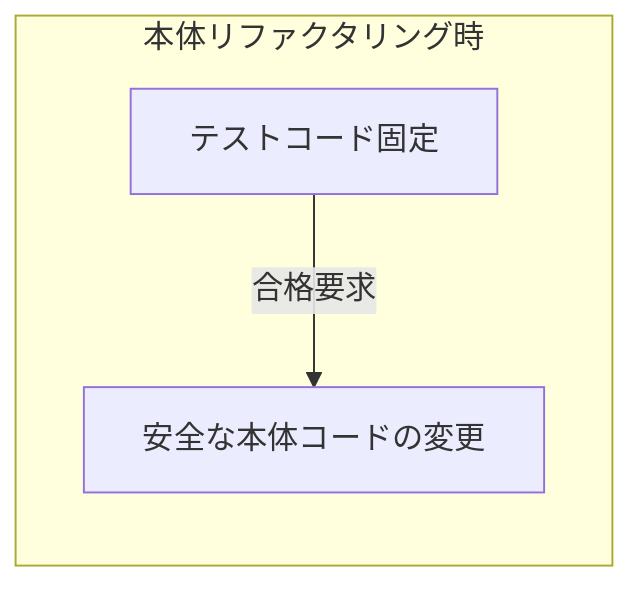
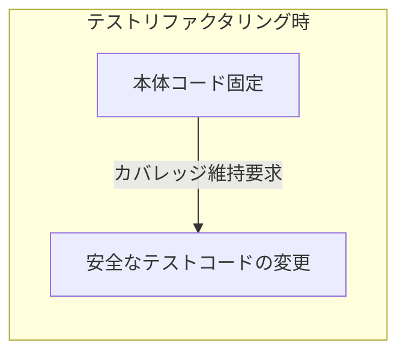

:::message
この記事は 8 割ぐらい AI が書いています。だいぶ人間っぽく寄せようとしましたが，今回は Tech ではなく Idea 寄りの記事なので，多少はご容赦ください…
:::

# はじめに

この記事は [Go - Qiita Advent Calendar 2025](https://qiita.com/advent-calendar/2025/go) (Series 2) の 25 日目の記事です。プログラミング言語のアドベントカレンダーは技術寄りのトピックが多いと思いますが，今回は初めてのアイデア寄りの記事になりそうです。

https://zenn.dev/mpyw/articles/new-relic-go-agent-struggle
https://zenn.dev/mpyw/articles/go-context-feature-flags

1〜2 週間で OSS ライブラリ 5 本，記事 2 本を出してしまいました。

↓ Go テンプレートでカスタマイズ可能な全関数計装コードジェネレータ
https://pkg.go.dev/github.com/mpyw/ctxweaver

↓ Goroutine への [`context.Context`](https://pkg.go.dev/context#Context) 伝播漏れを検出する Linter
https://pkg.go.dev/github.com/mpyw/goroutinectx

↓ zerolog での `.Ctx(ctx)` 呼び出し漏れを検出する Linter
https://pkg.go.dev/github.com/mpyw/zerologlintctx

↓ [`*gorm.DB`](https://pkg.go.dev/gorm.io/gorm#DB) インスタンスの unsafe な再利用を検出する Linter
https://pkg.go.dev/github.com/mpyw/gormreuse

↓ Feature Flag のボイラープレートをジェネリクスで削減するライブラリ
https://pkg.go.dev/github.com/mpyw/feature

これらの殆どは Vibe Coding で開発しました。 Go 言語製のライブラリなので，これらについて熱く語る記事を書きたい！と最初は思っていたのですが，**「Linter を Vibe Coding で開発した」こと自体が最も語るべき内容では？** と考え直して今に至ります。

# Vibe Coding と TDD

Vibe Coding とは，AI に雰囲気（vibe）で指示を出してコードを書かせる開発スタイルです。巷では「No Code」や「素人が何でも作れる」みたいな文脈で語られることもありますが，私はそうは思っていません。基礎力を活かして AI のハルシネーションを是正しながら正しい方向に導くスキルは絶対に必要だし，その裏付けとしてこれまで培ってきた経験が腐ることはないと信じています。

そもそも **AI の出力は確率的に変化します**。モデルの性能が良ければ毎回それっぽい結果に収束するとはいえ，微妙なニュアンスの違いは含まれるし，タスクの難易度によって期待した出力が得られる確率も変動する。AI を使っている時点で「自分がやるにはしんどい物量」「自分が技術的に到達しきれていない領域」を任せることが多く，そのコード出力すべてを理解するには常に困難が付き纏います。

そこで救世主となるのが **TDD (Test Driven Development)** です。ある入力に対してこういう結果が得られる，というのをあらかじめスタブのテストとして書いておき，後からそれをパスするように作る。高度に一般化して実装するのが人間にとって難しい領域であったとしても，**具体例をいくつか挙げることぐらいは人間にとっても着手しやすい**。AI のお膳立てのために人間として最低限の仕事をここでしておくのです。

具体例を挙げましょう。 [goroutinectx](https://pkg.go.dev/github.com/mpyw/goroutinectx) は「Goroutine に [`context.Context`](https://pkg.go.dev/context#Context) を伝播し忘れている」ケースを検出する Linter です。

:::message
以下のコードスニペットは，実際のテストケースからの抜粋です。 Go の [`analysistest`](https://pkg.go.dev/golang.org/x/tools/go/analysis/analysistest) パッケージは，Linter のテストを書くための公式サポートパッケージです。 `// want "..."` コメントをつけた行で Linter の警告が出ることをテストしてくれます。
:::

```go
// ❌ Bad: Goroutine 内で ctx を使っていない
func handler(ctx context.Context) {
    go func() {
        doSomething() // want "goroutine does not propagate context"
    }()
}

// ✅ Good: Goroutine 内で ctx を伝播している
func handler(ctx context.Context) {
    go func() {
        doSomething(ctx)
    }()
}
```

技術的な話をすると，「これなら [contextcheck](https://pkg.go.dev/github.com/kkHAIKE/contextcheck) でええやん？」と思うかもしれませんが，この Linter は **Goroutine の中にコンテキスト引数を必要とするものがなくても先手を打って警告する** ところが特徴。あとで「設計ミスった！」ってなるのを前もって防いでくれます。使わなかったとしても `_ = ctx` って書いてあれば設計者がコンテキスト引数の設定漏れに気づくでしょ？という観点から。

```go
func handler(ctx context.Context) {
    go func() {
        _ = ctx // ✅ 現状 doSomething 関数がコンテキストを要求していない場合の対応
        doSomething()
    }()
}
```

こういったテストケースを， **Linter のコードが書かれる前から** 機能要件として具体例ベースでいくつも挙げておく。難しいことはよく分からなくても，

***「このコードは NG，このコードは OK」***

という具体例を挙げるのは人間でもできます。TDD の強みはここにあります。またエッジケースは AI に

> 💬 ***「他にどんなエッジケースが考えられる？網羅的に列挙して」***

と聞けばどんどん出てきます。**量産は AI の得意分野なので困ったら頼りましょう**。といっても投げっぱなしではだめで， AI が投げてきたボールをあなたが打ち返す必要があります。「これは要件に合っているか？」「漏れはないか？」を人間がチェックするのです。当然ながら，ここにある程度の基礎力は求められます。

# なぜ Linter 開発が Vibe Coding に適しているのか

## 業務コードとの対比

さて Linter の話に戻りますが，なぜ Linter は Vibe Coding に適していると考えられるのでしょうか？業務コードと比較してみましょう。

| 観点 | 業務コード | Linter |
|:-----|:----------|:-------|
| 技術的難易度 | 低〜中 | 高 |
| 業務固有要件 | 多い（AI に教え込むコスト高） | 少ない（AI は最初から理解している） |
| 運用リスク | 金銭的損失に繋がりうる | ない（`//xxx:ignore` で済む） |
| 責任 | 求められる | 取る必要がない |

業務コードは，技術的な難易度はそれほど高くなくても，業務固有の要件が発生していることが多く，AI に普遍的なナレッジを教え込むコストが高いです。またサービス運用上のリスクとして金銭的な損失に繋がりうるので，バグの許容度が低い。責任の所在は AI には務まりません。

一方 Linter は，技術的な難易度が高い一方で業務固有の要件は少なめ。**広く知れ渡った技術的なベストプラクティスが土台になっている** ことが多く，AI は最初からそれを理解しており，自走的なサイクルを回してもらいやすいです。サービス運用上のリスクもない。開発時にバグを踏んでも，一時的に `//xxx:ignore` `TODO: Linter のバグがあるので修正する` 等のコメントをつけるだけで済みます。しくじっても誰にも迷惑をかけません。このやり方だったら，責任を取ることに怯えるポジションであるプロダクトオーナーも，きっと安心して AI に任せてくれることでしょう。

## TDD との相性がいい

先ほど TDD の話をしましたが，Linter 開発は TDD との相性が抜群です。

| 観点 | 業務コード | Linter |
|:-----|:----------|:-------|
| 入力 | ユーザー操作，API リクエスト，DB 状態… | ソースコード（テキスト） |
| 出力 | 画面表示，レスポンス，副作用… | 診断結果（位置 + メッセージ） |
| 外部依存 | DB，ネットワーク，ファイルシステム… | なし |
| テストの書きやすさ | モック・スタブが必要になりがち | 極めて高い |

Linter のテストは **「このコードを入力したら，この行でこの警告が出る」** という形式に集約されます。外部依存がなく，入出力が明確で，テストケースが書きやすい。[`analysistest`](https://pkg.go.dev/golang.org/x/tools/go/analysis/analysistest) パッケージのおかげで，テストコード自体もシンプルに書けます。

:::message
[`analysistest`](https://pkg.go.dev/golang.org/x/tools/go/analysis/analysistest) にはスタブ機能もあります。`testdata/src/` という特殊なディレクトリ配下にパッケージの名前空間通りにディレクトリを掘って，必要な型や関数のシグネチャだけ定義しておけば OK。実装は空でいいので，外部パッケージの巨大な依存を持ち込まずにテストできます。

```text
testdata/
└── src/
    ├── github.com/
    │   └── newrelic/
    │       └── go-agent/
    │           └── v3/
    │               └── newrelic/
    │                   └── newrelic.go  # Transaction 型などのスタブ
    └── testcases/
        ├── bad/
        │   └── bad.go      # want "..." で警告を期待
        └── good/
            └── good.go     # 警告が出ないことを確認
```
:::

一般的に TDD といえば

*「まず公開インタフェースを踏まえた上で interface を定義して，モックを作って，DI して…」*

みたいな儀式が必要になりがちですが，Go の Linter テストにはそういうボイラープレートが一切ありません。非常に書きやすいです。

この「入力と出力が明確」という特性は，AI にとっても人間にとっても嬉しい。人間は具体例を挙げやすいし，AI は具体例から一般化しやすい。**TDD のサイクルが自然に回る土壌が最初から整っている** のです。

## OSS として成果共有しやすいテーマである

付け焼き刃的な Linter なら誰でも作れます。雑に [`ast.Inspect`](https://pkg.go.dev/go/ast#Inspect) してパターンマッチングするだけで，ある程度は動くものはできます。しかしそれは業務をその場しのぎで支えるというだけで，今後別の業務で同じような問題に遭遇したときに「また一から作り直し？」となってしまいます。

汎用性が高い Linter であれば，最初から OSS として公開しておけば **他の業務でも再利用できるし，コミュニティからのフィードバックで品質も上がっていきます**。そして何より，**Vibe Coding の成果物がそのまま自分のポートフォリオになる。会社の業務コードは表に出せないけど，Linter は出せる。** 業務のコード品質を守りつつ，自分の GitHub も潤う。そして顔も知らない世界の誰かを救うことになる。一石二鳥どころの話じゃないですね。

> 💬 *「OSS クオリティのお行儀のいい Linter を作るのは難易度が高い」*
> 💬 *「いちいち業務時間犠牲にしてそこまで凝り性なことやってらんねーよ」*

って？ **その仕事，AI が大得意な部分なので任せましょうよ**。 AI に爆速で作らせて脳汁ドバドバ出して，OSS にしましょう。業務コードだったら絶対オーバーエンジニアリングって怒られるような内容でも，独立した OSS として切り出すなら話は別です。AI のスピード感を活かしてセルフレビューでガンガンマージしていき，**「業務コードはシンプルに，Linter はリッチに」** を実現しましょう。

Vibe Coding 流行ってるから活用して何か作りたいけど，まだ人に見せられるレベルのもの作れてないよ…って方，大チャンスですよ？

## Linter が持つ好循環

成果物として得られた Linter は，人間が書く業務コードだけでなく…

**AI が書くことになる業務コードも，コード品質が下がらないように下支えしてくれます**。

*「`CLAUDE.md`, [`AGENTS.md`](https://agents.md/) に指示書いておけばいいじゃん」* が基本ではありますが，その結果保証は 100% ではなく確率に左右されてしまいます。**Linter の出力は安定しており，入力が同じなら毎回出力も同じです**。普通書かれないようなコードを除き，Linter の想定の範囲内であればミスの検出率をほぼ 100% にすることも可能であると思います。それはもう Linter が価値を余すことなく発揮してくれる領域です。

あれ？この構図，どこかで見ませんでしたか？そうです，最初の TDD の話です。 

**「不安定な出力を安定化する」**

という観点ではそっくりですよね。



実際には Linter だけで品質担保ができるわけではなく，並行して実施するテストが主力になることには変わりないですが，Linter がコード品質の下支えをしてくれることは間違いありません。**Linter 開発は Vibe Coding の最高の練習台であり，かつ成果物が人間と AI 両方のコード品質を下支えしてくれる最高の好循環を生み出します**。

# Claude Code (Opus) + Serena という最強タッグ

https://code.claude.com/docs/ja/overview

https://oraios.github.io/serena/01-about/000_intro.html

正直 **Claude Code (Opus) + Serena の組み合わせは最強** です。連続したタスクから脱線せずに遂行する能力が極めて高いし，とくに Linter 開発においては局所的にも最適解に近いものを安定して出しているようにすら思います。導入方法はググればいくらでも出てくると思うので，ここでは省略します。

構文木のパターンマッチングで大量の switch-case 分岐をカバーするとか，そういった物量に対応するのは AI が圧倒的に得意だし，その分岐の中で個別に求められる高度な知識も惜しみなく披露してくれますね。私は仕事が遅いし構文解析にはそこまで詳しくないので，基本的には AI の圧倒的なスピードの仕事を眺めているだけです…

## 秘伝のプロンプト: 5 フェーズの品質改善サイクル

初動はあまり細かく指示出さなくても，ほとんど完璧に自走してプロトタイプまでは一瞬で作ってくれるんですけど，そこから先の機能をリッチにしていくフェーズやコード品質を上げていくフェーズでは，色々とプロンプトテクニックは求められると思います。

私が愛用していたプロンプトに含まれる **5 フェーズの品質改善サイクル** を紹介します。実際に [goroutinectx の CLAUDE.md](https://github.com/mpyw/goroutinectx/blob/main/CLAUDE.md) に書いてある内容です。もちろんこれは全部人間が書いたのではなく， Claude Code 自身が書いたものがベースになっています。

:::message
結局この部分も AI に書かせたのかよ！？はい，そうです。さっきの構図，無限に出てきますね。


:::

| Phase | ペルソナ                                 | 役割                                                              |
|:------|:-------------------------------------|:----------------------------------------------------------------|
| 1     | **QA エンジニア**                         | 徹底的にエッジケースをつつきまくる。検出できない限界があれば `[LIMITATION]:` マーカーをコメントに残す     |
| 2     | **実装エンジニア**                          | `[LIMITATION]` を確認し，解決を試みる。実用上の検出精度向上を優先                        |
| 3     | **コードスタイルエンジニア**                     | リファクタリングレビュー。提案を「Should not do / Either way / Should do」に分類して実施 |
| 4     | **新人エンジニア**                          | 素朴な質問で「わかりにくい部分」を炙り出す                                           |
| 5     | **先生コンビ<br> (実装エンジニア+コードスタイルエンジニア)** | 複雑な概念を説明し， `CLAUDE.md` や `ARCHITECTURE.md` を更新                  |

**→ Phase 1 に戻ってサイクルを繰り返す**

ポイントは **`[LIMITATION]:` マーカー** です。「理想の動作と現状のギャップ」をコード中にコメントとして残しておくことで，次のフェーズで AI が自動的にそれを拾って改善を試みてくれます。 QA エンジニアが発見したエッジケースを QA エンジニア自身が直ちに解決することはしませんが， **「ここを次のフェーズで解決してね」** とコンテキストに残して伝えておけば，実装エンジニアがそれを拾って解決を試みてくれます。

```go
// [LIMITATION]: 現状は関数リテラル内の Goroutine 起動を検出できない
// 理想的には再帰的に解析すべきだが，複雑度とのトレードオフで見送り
```

これらのプロンプト指針を伝えて，

> 💬 ***「このメンバーでサイクルを 5 回回して。今からお風呂入ってくるからその間勝手にやっといて」***

って伝えて数十分後に戻ってくると，あっという間にとんでもない高品質なものが出来上がってたりします。私はこの成果を目の当たりにしたとき，初めて

*「人間の IT エンジニアはもう失職寸前なのではないか？」*

という危機感すら抱きました。

## 秘伝のプロンプト: リファクタリング時の鉄則

もう 1 つ，リファクタリング時に必ず伝える呪文があります。

> 💬 ***「本体コードをリファクタリングするときは，テストが絶対落ちないようにして」***
> 💬 ***「テストコードをリファクタリングするときは，本体カバレッジが絶対落ちないようにして」***

これを伝えておかないと，AI がリファクタリングの勢いでテストを壊したり，不要と判断したテストを消してカバレッジが下がったりすることがあります。**片方を固定してもう片方を変える**。シンプルだけど効果絶大です。





ここまで挙げてきた図の関係性にそれぞれ当てはまりますね。**「不安定な出力を安定化する」** という構図は，生成 AI 時代のあらゆる場面で意識すべきベストプラクティスなのかもしれません。

これは Linter 文脈に限らず，業務コードのリファクタリングでも同様です。生成 AI 時代のリファクタリングにおける鉄則としてぜひ覚えておいてください。

## 人間と AI の協働: 設定ファイルのスキーマ設計

ここまで「AI に任せる」話をしてきましたが，**全部 AI 任せではありません**。例えば [ctxweaver](https://pkg.go.dev/github.com/mpyw/ctxweaver) の YAML スキーマ設計は，人間と AI が壁打ちしながら一緒に育てた例です。

最初はパッケージ指定する方法が， `patterns` だけのシンプルな設計でした。これは Go ではお馴染みのパッケージパターン記法（`./...`）ですね。

https://zenn.dev/kanmu_dev/articles/75f227728cad19

```yaml
patterns: ["./..."]
```

次に「パッケージ群の中から特定ファイルだけ正規表現で除外したい」と思って `exclude_regexps` を追加しました。 JSON の `string` という型名だけでは「何を書けばいいのか」がユーザーに伝わらない。ハンガリアン記法的に，正規表現であることを明示すべきだと考えてこの命名にしました。 今思えば，めっちゃ付け焼き刃感ありますね…

```yaml
patterns: ["./..."]
exclude_regexps: ["_test\\.go$", "/mock/"]
```

AI に設計をレビューしてもらうと，

> - 取り込みと除外で指定方式が異なり，対称性が無いのが分かりにくい
> - 語感的に並びとしては `exclude` があるなら `include` も無いと分かりにくい
>   - とはいえ，この 2 つが並ぶと優先順位がわからない

のようなフィードバックを受けました。完全に正論ですね。加えて更に，

> - 「`match` / `ignore` とかの語彙もありますよ」

という提案も返ってきました。最初これを採用しようと思ったのですが…やはり `patterns` があるなら正規表現であることを明示しないと誤解を招きそう。だったらもう `regexps` の中に `include` / `exclude` をまとめてしまおう，と考えました。ここから更に， [TypeScript の Utility Types](https://www.typescriptlang.org/docs/handbook/utility-types.html) や [Laravel の `Arr` ヘルパー](https://laravel.com/docs/12.x/helpers#method-array-only) の命名を思い出して，

> 💬 ***「`regexps: { only: '...', omit: '...' }` なんてどう？」***

と提示したところ，AI も「いいですね！！」と賛成してくれて，今の形になりました。これなら Go のパッケージ指定記法と正規表現の差が分かりやすいし，命名もシンプルにできています。

```yaml
packages:
  patterns: ["./..."]
  regexps:
    only: ["^github\\.com/mpyw/"]    # マッチするものだけ処理
    omit: ["_test\\.go$", "/mock/"]  # マッチするものを除外
```

AI に丸投げでもなく，人間が全部考えるでもなく，壁打ちしながら設計が育っていく。これが Vibe Coding の実態だと思っています。

# 人間に残る仕事とは？

それでも AI は無理難題には対応しきれないときはありますね。そういうときに

***「難しそうなのでやっぱり撤回します，コミットをここまで戻して」***
***「もう少しシンプルなアプローチにしましょう」***

など，その辺の匙加減を知ったうえで臨機応変に提示する能力は人間に求められそうです。また試行錯誤を重ねているとコードがどんどん汚れてくるので，

*「デッドコードを削除して」*
*「リファクタリングいれましょうか」*
***「デッドコードさっき消してもらったけど，ここがまだ漏れてるよ」***
***「フラットに関数並べすぎてるからファイル分割して」***
***「名前空間汚染がひどいからプレフィクスつけて」***

みたいな指示はよく出していました。 Go 言語だと特にフラットパッケージ思想で安直に名前空間汚染起きがちですよね，そのため特に気をつけていました。また 5 フェーズのサイクルでもやっぱり漏れはあるので，**コードカバレッジは徹底的に計測** して，カバレッジ漏れてるところのテストを指示したり，それでも**カバレッジ 0% のところは必要性を再検討させて削除判断をさせたり**，など。

:::message
「それ全部プロンプト化すればいいじゃん」って思いましたか？
:::

確かにプロンプト化できちゃいます。じゃあ人間の仕事って何が残るの？私が最初に考えたのは，**まだ言語化しきれていない「ふわっとした整合性」を敏感に感じ取って臨機応変に対応すること** でした。命名の一貫性，抽象度のバランス，コンテキストを跨いだ判断，「動くけど気持ち悪い」の言語化…

ただ，Claude Code (Opus) が優秀すぎて，思考の過程で 

***「ん？これはおかしい。この関数の目的は…だったはずだから，こう改修してしまうと元の目的から脱線してしまう」***

と，人間らしさ全開で慎重な思考を重ねていることを観測し，結果として正しいゴールに自力でたどり着く姿を何回も見かけてしまったんですよね…

さて， Claude Code が人間を必要としてくれるのはいつまででしょうね…？最後まで残るのは，責任を取ってプルリクエストをマージしてリリースする，要するにハンコを押す仕事ぐらいでしょうか…？

# まとめ

- **Vibe Coding は「素人が何でも作れる」ではない**。基礎力を活かしてハルシネーションを是正するスキルは必須
- **TDD は AI 時代の救世主**。具体例を挙げるのは人間，量産と一般化は AI
- **Linter 開発は Vibe Coding の最高の練習台**。業務リスクなし，AI が得意な領域，成果物は人間と AI 両方のコード品質を下支え
- **Claude Code (Opus) + Serena は革命的**。自己修正能力まで備えている
- **人間に最後まで残る仕事は，まだ言語化しきれていない「ふわっとした整合性」を感じ取って臨機応変に対応すること？**

Linter 開発，やってみませんか？AI に爆速で作らせて脳汁ドバドバ出して，OSS にしましょう。
