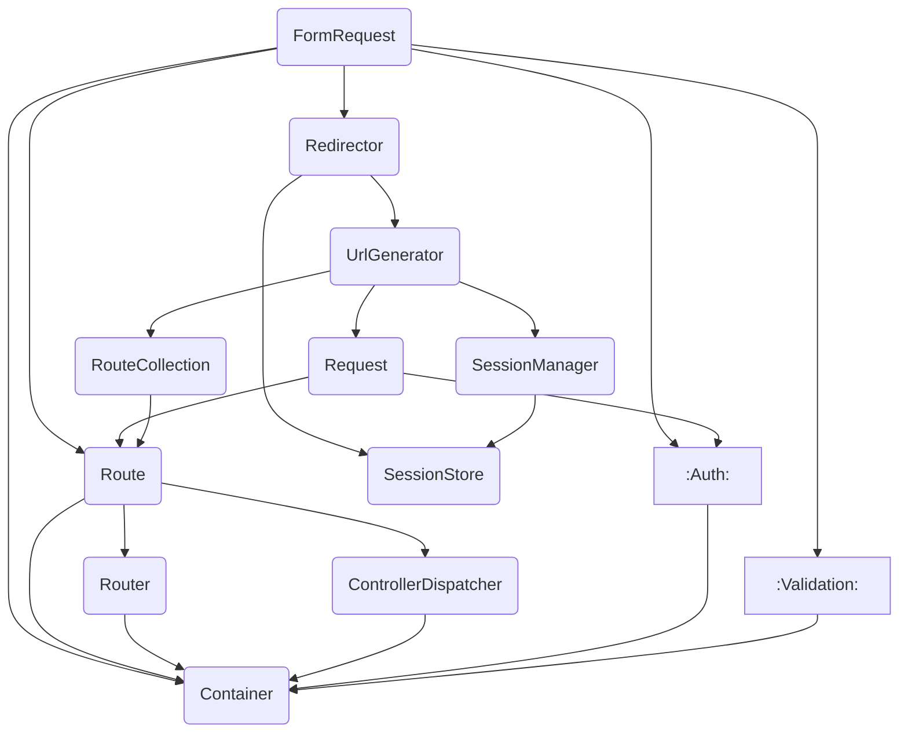
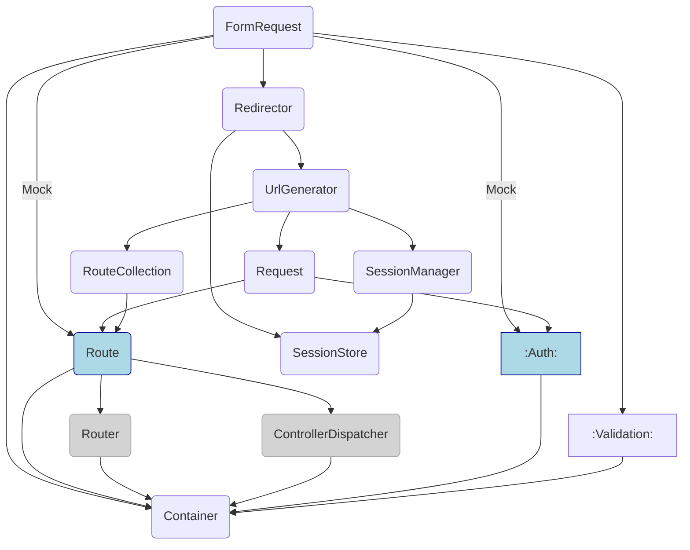

## Laravel の FormRequest とは？

基本的な説明は割愛します。公式ドキュメントを参照してください。

https://laravel.com/docs/validation#form-request-validation

## FormRequest が実際に解決される動き

これに関しても以下の記事によくまとまっていますので，リンクしておきます。

https://qiita.com/wim/items/9718ae5b885c324dd38f

ポイントとなるのは [`FormRequestServiceProvider`](https://github.com/laravel/framework/blob/37cb3450150cf75af787dc9bcd8de08370024008/src/Illuminate/Foundation/Providers/FormRequestServiceProvider.php#L22-L38) にある

> ```php
> $this->app->afterResolving(ValidatesWhenResolved::class, function ($resolved) {
>     $resolved->validateResolved();
> });
> 
> $this->app->resolving(FormRequest::class, function ($request, $app) {
>     $request = FormRequest::createFrom($app['request'], $request);
> 
>     $request->setContainer($app)->setRedirector($app->make(Redirector::class));
> });
> ```

という部分。大枠は以下のような動きになります。

### 1. **`Request` がカーネルによってサービスコンテナに登録され，グローバルミドルウェアとともに処理が開始される**

[`Illuminate\Foundation\Http\Kernel::sendRequestThroughRouter()`](https://github.com/laravel/framework/blob/37cb3450150cf75af787dc9bcd8de08370024008/src/Illuminate/Foundation/Http/Kernel.php#L158-L176) によって，ルーターにディスパッチされる直前にリクエストインスタンスが **グローバルに** サービスコンテナに登録されます。 **「原則 1 リクエスト ＝ 1 プロセス」** と割り切っている PHP だからこそできる荒業ですね。
> ```php
> /**
>  * Send the given request through the middleware / router.
>  *
>  * @param  \Illuminate\Http\Request  $request
>  * @return \Illuminate\Http\Response
>  */
> protected function sendRequestThroughRouter($request)
> {
>     $this->app->instance('request', $request);
>
>     Facade::clearResolvedInstance('request');
>
>     $this->bootstrap();
>
>     return (new Pipeline($this->app))
>                 ->send($request)
>                 ->through($this->app->shouldSkipMiddleware() ? [] : $this->middleware)
>                 ->then($this->dispatchToRouter());
> }
> ```
:::message
ちなみにこの `'request'` という文字列ですが， [`Illuminate\Foundation\Application::registerCoreContainerAliases()`](https://github.com/laravel/framework/blob/37cb3450150cf75af787dc9bcd8de08370024008/src/Illuminate/Foundation/Application.php#L1462) によって `Illuminate\Http\Request::class` がエイリアス登録されています。コントローラに `Request $request` と書いて DI できるのはこのエイリアスのおかげです。
:::
:::message
このフェーズで [`Request::user()`](https://github.com/laravel/framework/blob/37cb3450150cf75af787dc9bcd8de08370024008/src/Illuminate/Http/Request.php#L599-L608) というメソッドで認証中のユーザを取得できるようになりますが，ロジックそのものは一切 `Request` クラスは持っていません。 [セッターインジェクション](https://github.com/laravel/framework/blob/37cb3450150cf75af787dc9bcd8de08370024008/src/Illuminate/Auth/AuthServiceProvider.php#L80-L92) によって `Auth::user()` に相当するロジックが注入されます。
> ```php
> /**
>  * Handle the re-binding of the request binding.
>  *
>  * @return void
>  */
> protected function registerRequestRebindHandler()
> {
>     $this->app->rebinding('request', function ($app, $request) {
>         $request->setUserResolver(function ($guard = null) use ($app) {
>             return call_user_func($app['auth']->userResolver(), $guard);
>         });
>     });
> }
> ```
:::

### 2. **`Request` が `Router` にディスパッチされ，ルートミドルウェアとともに処理が続行される**

[`Illuminate\Routing\Router::dispatch()`](https://github.com/laravel/framework/blob/37cb3450150cf75af787dc9bcd8de08370024008/src/Illuminate/Routing/Router.php#L727-L738) → [`Illuminate\Routing\Router::runRouteWithinStack`](https://github.com/laravel/framework/blob/37cb3450150cf75af787dc9bcd8de08370024008/src/Illuminate/Routing/Router.php#L788-L808) あたりの処理になります。
:::message
このフェーズで [`Request::route()`](https://github.com/laravel/framework/blob/37cb3450150cf75af787dc9bcd8de08370024008/src/Illuminate/Http/Request.php#L610-L626) というメソッドで実行中の `Route` を取得できるようになりますが，ロジックそのものは一切 `Request` クラスは持っていません。 [セッターインジェクション](https://github.com/laravel/framework/blob/37cb3450150cf75af787dc9bcd8de08370024008/src/Illuminate/Routing/Router.php#L779) によって `Router` が解決した `Route` のインスタンスが注入されます。
> ```php
> /**
>  * Return the response for the given route.
>  *
>  * @param  \Illuminate\Http\Request  $request
>  * @param  \Illuminate\Routing\Route  $route
>  * @return \Symfony\Component\HttpFoundation\Response
>  */
> protected function runRoute(Request $request, Route $route)
> {
>     $request->setRouteResolver(fn () => $route);
> 
>     $this->events->dispatch(new RouteMatched($route, $request));
> 
>     return $this->prepareResponse($request,
>         $this->runRouteWithinStack($route, $request)
>     );
> }
> ```
:::

### 3. **`FormRequest` がサービスコンテナによって解決される**

サービスコンテナによる解決処理に関しては元の @wim さんの記事を参照してください。 FormRequest 固有の特筆すべき点はありません。

### 4. **`FormRequest` の `resolving` コールバックが発火し， `Request` の構成内容が `FormRequest` にコピーされる**

`FormRequest` の継承クラスすべてに対して以下で登録されたコールバックが発火します。
> ```php
> $this->app->resolving(FormRequest::class, function ($request, $app) {
>     $request = FormRequest::createFrom($app['request'], $request);
> 
>     $request->setContainer($app)->setRedirector($app->make(Redirector::class));
> });
> ```
まず `FormRequest` の継承元クラスに実装されている [`Illuminate\Http\Request::createFrom()`](https://github.com/laravel/framework/blob/37cb3450150cf75af787dc9bcd8de08370024008/src/Illuminate/Http/Request.php#L431-L471) によって，以下のようなコピーが行われます。
> ```php
> /**
>  * Create a new request instance from the given Laravel request.
>  *
>  * @param  \Illuminate\Http\Request  $from
>  * @param  \Illuminate\Http\Request|null  $to
>  * @return static
>  */
> public static function createFrom(self $from, $to = null)
> {
>     $request = $to ?: new static;
> 
>     $files = array_filter($from->files->all());
> 
>     $request->initialize(
>         $from->query->all(),
>         $from->request->all(),
>         $from->attributes->all(),
>         $from->cookies->all(),
>         $files,
>         $from->server->all(),
>         $from->getContent()
>     );
> 
>     $request->headers->replace($from->headers->all());
> 
>     $request->setRequestLocale($from->getLocale());
> 
>     $request->setDefaultRequestLocale($from->getDefaultLocale());
> 
>     $request->setJson($from->json());
> 
>     if ($from->hasSession() && $session = $from->session()) {
>         $request->setLaravelSession($session);
>     }
> 
>     $request->setUserResolver($from->getUserResolver());
> 
>     $request->setRouteResolver($from->getRouteResolver());
> 
>     return $request;
> }
> ```
そして `FormRequest` が依存する `Container` と `Redirector` のインジェクションが行われます。クラス生成時点ではコンストラクタインジェクションされておらず，生成後の任意タイミングでセッターインジェクションする方式を採用しています。

### 5. **`FormRequest::validateResolved()` が実行される**

[`ValidatesWhenResolved` インタフェース](https://github.com/laravel/framework/blob/37cb3450150cf75af787dc9bcd8de08370024008/src/Illuminate/Contracts/Validation/ValidatesWhenResolved.php) の実装クラスすべてに対して以下で登録されたコールバックが発火します。
> ```php
> $this->app->afterResolving(ValidatesWhenResolved::class, function ($resolved) {
>     $resolved->validateResolved();
> });
`FormRequest` は [`ValidatesWhenResolvedTrait` トレイト](https://github.com/laravel/framework/blob/37cb3450150cf75af787dc9bcd8de08370024008/src/Illuminate/Validation/ValidatesWhenResolvedTrait.php#L17-L36) をミックスインしているため，これが実行されます。
> ```php
> /**
>  * Validate the class instance.
>  *
>  * @return void
>  */
> public function validateResolved()
> {
>     $this->prepareForValidation();
> 
>     if (! $this->passesAuthorization()) {
>         $this->failedAuthorization();
>     }
> 
>     $instance = $this->getValidatorInstance();
> 
>     if ($this->isPrecognitive()) {
>         $instance->after(Precognition::afterValidationHook($this));
>     }
> 
>     if ($instance->fails()) {
>         $this->failedValidation($instance);
>     }
> 
>     $this->passedValidation();
> }
> ```
ここでバリデーターの準備や失敗時の例外のスロー，更には [Precognition](https://laravel.com/docs/precognition) の特別対応なども入っています。
:::message
[`Precognition::afterValidateHook()`](https://github.com/laravel/framework/blob/37cb3450150cf75af787dc9bcd8de08370024008/src/Illuminate/Foundation/Precognition.php#L7-L20) の実装は以下です。成功時もコントローラに侵入させないことによって事前バリデーションの実装をサボるのが Precognition という機能のコンセプトですが，その実態はこのようになっています。
> ```php
> /**
>  * Get the "after" validation hook that can be used for precognition requests.
>  *
>  * @param  \Illuminate\Http\Request  $request
>  * @return \Closure
>  */
> public static function afterValidationHook($request)
> {
>     return function ($validator) use ($request) {
>         if ($validator->messages()->isEmpty() && $request->headers->has('Precognition-Validate-Only')) {
>             abort(204, headers: ['Precognition-Success' => 'true']);
>         }
>     };
> }
> ```
なんと， **`204 No Content` を返す HTTP 例外をスローする** というアクロバティックな実装になっています。[直接発生させられた HTTP 例外はエラーログに記録されない](https://github.com/laravel/framework/blob/37cb3450150cf75af787dc9bcd8de08370024008/src/Illuminate/Foundation/Exceptions/Handler.php#L113) ため，異常系ハンドリングに悪影響を及ぼすこともないというわけですね。
:::

## クラスの依存関係を確認

`FormRequest` をテストにするにあたって，どこまで実際に動かしてどこまでモックするのかを検討するために，まず依存関係を大雑把に書き起こしてみます。完全な図を再現しようとすると破綻するので，かなり簡略化しています。



またテストの粒度として，私は大きくわけて以下の 3 つがあると考えています。

| 区分          | 説明                                                    |
|:------------|:------------------------------------------------------|
| Unit        | クラス単体のテスト。<br>そのクラスだけでテストを完結させ，依存クラスはすべてモックする。        |
| **Feature** | **クラスの機能を実際に動かすテスト。**<br>**依存関係は関心のある範囲までモックせずに動かす。** |
| Integration | アプリケーション全体の統合テスト。<br>クラスの単位ではなく API アクセスなどの単位でテストする。  |

この定義に従うとすれば， `FormRequest` のテスト粒度としては Feature が一番向いていると考えています。これに即して，今回はモックする範囲を以下のように検討してみます。



この際， `Redirector` `UrlGenerator` `SessionStore` あたりを実際に動かすべきと考える理由は以下です。

- リクエストとセッションは密接している。
- エラー時にリダイレクトのための情報が `ValidationException` に詰め込まれてスローされるが，頑張ってモックを書くよりも実際の動きに任せたほうが正確であり，テストを書くのもラクになる。
  - JSON API の場合は，実際に使われることがないので書いてもほとんど無駄になる。
  - JSON API でない場合も，実際のルーティング定義やセッションの状況次第でリダイレクト先がどうなるか，信頼性の高いテストをしたほうがよい。

## テスト構成例

以下のような，汎用的な基底クラスを作っておきます。解決方法は何通りかあるので，ご自身に合ったものを考えてください。

```php
<?php

declare(strict_types=1);

namespace Tests\Feature;

use Illuminate\Contracts\Auth\Authenticatable;
use Illuminate\Foundation\Http\FormRequest;
use Illuminate\Foundation\Testing\TestCase;
use Illuminate\Http\Request;
use Illuminate\Routing\Route;
use Illuminate\Validation\ValidationException;
use Mockery;
use Tests\CreatesApplication;

/**
 * @phpstan-template T of FormRequest
 */
abstract class FormRequestTestCase extends TestCase
{
    use CreatesApplication;

    /**
     * 使用する FormRequest クラス名を返却
     *
     * @return class-string<T>
     */
    abstract protected function class(): string;

    /**
     * 典型的な JSON API のための FormRequest 生成
     * （JSON API ではない場合は適宜調整してください）
     *
     * @phpstan-param 'GET'|'POST'|'PUT'|'PATCH'|'DELETE' $method
     * @phpstan-return T
     * @throws ValidationException
     * @noinspection PhpDocRedundantThrowsInspection
     */
    protected function resolve(
        string $method,
        array $routes = [],
        array $params = [],
        ?Authenticatable $user = null,
    ): FormRequest {
        $this->app->instance('request', $request = Request::create(
            uri: '', // URI そのものを使った処理がなければ空文字列で十分とする
            method: $method,
            // GET のときはクエリパラメータ， POST のときは JSON という仕様の API であるとする
            parameters: $method === 'GET' ? $params : [],
            server: $method === 'GET' ? [] : ['CONTENT_TYPE' => 'application/json'],
            content: $method === 'GET' ? null : (string)json_encode($params),
        ));

        // FormRequest で $this->route('...') したときの対応
        $route = Mockery::mock(Route::class);
        foreach ($routes as $key => $value) {
            $route->allows('parameter')->with($key, null)->andReturn($value);
        }

        $request->setUserResolver(fn () => $user);
        $request->setRouteResolver(fn () => $route);

        return $this->app->make($this->class());
    }

    /**
     * リクエストを解決してバリデーション結果を得る
     *
     * @phpstan-param 'GET'|'POST'|'PUT'|'PATCH'|'DELETE' $method
     * @phpstan-return T|ValidationException
     */
    protected function perform(
        string $method,
        array $routes = [],
        array $params = [],
        ?Authenticatable $user = null,
    ): FormRequest|ValidationException {
        try {
            return $this->resolve($method, $routes, $params, $user);
        } catch (ValidationException $e) {
            return $e;
        }
    }

    /**
     * 成功時のアサーション
     *
     * @phpstan-param T|ValidationException $value
     * @phpstan-assert T $value
     */
    protected function assertOk(mixed $value): void
    {
        $this->assertInstanceOf($this->class(), $value);
    }

    /**
     * 失敗時のアサーション
     *
     * @phpstan-param T|ValidationException $value
     * @phpstan-assert ValidationException $value
     */
    protected function assertFailed(mixed $value): void
    {
        $this->assertInstanceOf(ValidationException::class, $value);
    }
}
```

この基底クラスを，以下のように使用します。

```php
<?php

declare(strict_types=1);

namespace Tests\Feature;

use Illuminate\Contracts\Auth\Authenticatable;
use Mockery;
use PHPUnit\Framework\Attributes\Test;

/**
 * @phpstan-extends FormRequestTestCase<ExampleFormRequest>
 */
class ExampleTest extends FormRequestTestCase
{
    protected function class(): string
    {
        return ExampleFormRequest::class;
    }

    #[Test]
    public function 認証なし・クエリストリングを含むGETリクエスト(): void
    {
        $result = $this->perform(
            method: 'GET',
            params: ['foo' => '123'],
        );
        $this->assertOk($result);
    }

    #[Test]
    public function 認証なし・プレースホルダを含むGETリクエスト(): void
    {
        $result = $this->perform(
            method: 'GET',
            routes: ['foo_id' => '123'],
        );
        $this->assertOk($result);
    }

    #[Test]
    public function 認証なし・ルートモデルバインディングを含むGETリクエスト(): void
    {
        $result = $this->perform(
            method: 'GET',
            routes: ['foo' => Mockery::mock(Foo::class)],
        );
        $this->assertOk($result);
    }

    #[Test]
    public function 認証あり・ルートモデルバインディングを含むPOSTリクエスト(): void
    {
        $result = $this->perform(
            method: 'POST',
            routes: ['foo' => Mockery::mock(Foo::class)],
            params: [
                'foo' => null,
                'bar' => 123,
            ],
            user: Mockery::mock(Authenticatable::class),
        );
        $this->assertOk($result);
    }

    #[Test]
    public function 認証あり・ルートモデルバインディングを含むPOSTリクエスト・バリデーションエラーで失敗(): void
    {
        $result = $this->perform(
            method: 'POST',
            routes: ['foo' => Mockery::mock(Foo::class)],
            params: [
                'foo' => null,
                'bar' => 123,
            ],
            user: Mockery::mock(Authenticatable::class),
        );
        $this->assertFailed($result);
        $this->assertSame(
            [
                // ...,
            ],
            $result->errors(),
        );
    }
}
```

このように最小限のモックで，的確に `FormRequest` の中核部分をテストできるようになりました。今回は JSON API を想定しましたが， HTML のフォーム送信などもテスト可能で，その際リダイレクト先の検証もキャッチされた `ValidationException` から拾えるようになっています。幅広く応用できると思うので，参考にしていただければ幸いです。
