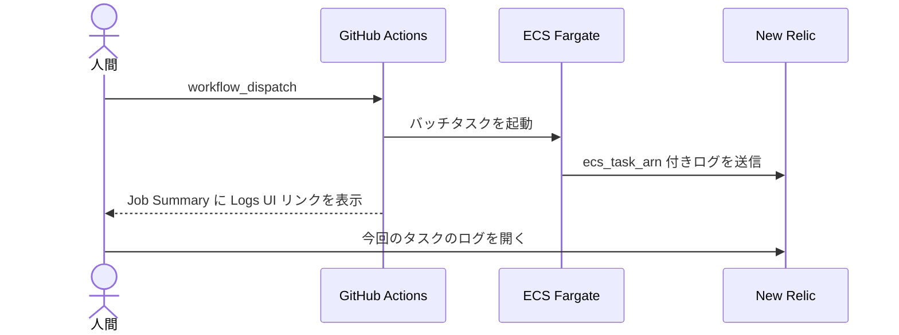

# はじめに

New Relic の Logs UI には，**任意の検索クエリで絞り込んだ状態を URL から直接開く方法** があります。公式には案内されていませんが， Nerdlet の URL State を組み立てれば，外部システムから特定のログへ誘導できます。

とあるプロジェクトでは， GitHub Actions の [`workflow_dispatch`](https://docs.github.com/ja/actions/how-tos/manage-workflow-runs/manually-run-a-workflow) から ECS Fargate のバッチタスクを起動しています。実行後にタスクが吐いたログを追えるよう， [Job Summary](https://docs.github.com/ja/actions/how-tos/manage-workflow-runs/manually-run-a-workflow) に **今回起動したタスクのログだけに絞り込んだ New Relic Logs UI へのリンク** を出しています。

New Relic に集約された各ログレコードには，次のような属性が付いています。

- `ecs_task_arn`: ログを出力した ECS タスクの ARN
- `level`: `trace` / `debug` / `info` / `warn` / `error` などのログレベル

リンク先の検索窓に `ecs_task_arn` を含むクエリを入れておけば，ワークフローを起動した人は Job Summary から今回のログへ直接移動できます。

ワークフローの流れは，概ね次のようなものです。



これとは更に別の URL 仕様も存在していましたが， 2026 年 8 月頃に動かなくなりました。 Logs UI 自体は開くものの検索窓だけが空になるため，変化にも気付きにくい状態でした。この記事は， New Relic の内部的な変更によるものと思われるこの変化をきっかけに，現在も動く方法を外から観測してまとめたものです。

:::message alert
この記事で扱う URL は， New Relic が Logs UI の外部連携用として公開している仕様ではありません。**現在動いていても， New Relic 側の変更で再び壊れる前提** で利用してください。
:::

# 公式の URL 生成手段は存在しない

非公式な URL State を組み立てる前に，公式の方法がないかを確認します。当然，公式に支援された方法があるならそちらを使うべきです。しかし今回調べた範囲では，**任意の検索クエリで絞り込んだ Logs UI を開く URL をプログラムから作る公式 API / 仕様は見つかりませんでした**。

## NerdGraph の Mutation を全件調べる

New Relic の API としてまず候補になるのは NerdGraph です。 GraphQL Introspection で Mutation を全件取得したところ，対象は **389 件** ありました。それらに対して，名前と Description を次の語で絞り込みました。

- `url`
- `link`
- `share`
- `permalink`
- `snapshot`

見つかったのは `dashboardCreateLiveUrl` や `dashboardCreateSnapshotUrl` など，**ダッシュボード専用** の Mutation だけでした。ダッシュボードには公式の共有 URL 生成機能がありますが，任意の `ecs_task_arn` を埋め込んだ Logs UI の検索条件を受け取り，共有 URL を返す Mutation は存在しませんでした。

## 公式の共有手段は UI 上の Copy permalink

New Relic が案内している共有方法は， UI 上の **Copy permalink** ボタンです。 2024 年 2 月の告知には，新しいクエリ体験では操作しても URL が変化しないため，ブラウザの URL ではなく Copy permalink を使うよう明記されています。人間が画面を操作してから共有する用途には十分ですが， GitHub Actions から検索条件を変えながら URL を生成する用途には使えません。

## かつての解説記事も残っていない

かつては New Relic 公式サポートに **Link to logs from outside New Relic** という，まさに今回の用途を扱う記事がありました。しかし現在，その URL から記事の中身は確認できません。

以上から，今回の用途では **非公式な URL State を組み立てるしかありません**。将来また動かなくなる可能性を受け入れたうえで利用します。

# New Relic One の URL State を解剖する

New Relic One の画面は， **Nerdlet** と呼ばれるプラグイン的なコンポーネントの集合です。開発者向けには `PlatformStateContext` と Nerdlet の URL State が公開されており，画面の状態を **base64 エンコードした JSON** として URL に載せられます。

大枠は次の形です。

```text
https://one.newrelic.com/launcher/<id>?pane=<base64(JSON)>&platform[accountId]=<account id>
```

ここには，性質の違う 2 種類の状態が同居しています。

| 場所 | 役割 |
|:---|:---|
| `platform[...]` | アカウントや時間範囲など，プラットフォーム共通の状態 |
| `pane` | Nerdlet 本体へ渡す URL State。 `nerdletId` を含む JSON を base64 で載せる |

この公開情報だけでは Logs UI 専用の全項目までは分かりませんが，状態が URL にどう運ばれるかを理解する手掛かりにはなります。

## 現在動く URL の形

2026 年 8 月時点で動作を確認できた URL は，次の 2 点が要になります。

- `query` と `duration` を `pane`，つまり Nerdlet の URL State 側へ載せる。
- パスには **Nerdlet の ID である `logger.log-tailer`** を使う。

```text
https://one.newrelic.com/launcher/logger.log-tailer
  ?pane=<base64(JSON)>
  &platform[accountId]=1234567
```

`pane` に載せる JSON は， `nerdletId`・`accountId`・`duration`・`query` で構成します。デコードした状態で見ると次の通りです。

```json
{
    "nerdletId": "logger.log-tailer",
    "accountId": 1234567,
    "duration": 86400000,
    "query": "ecs_task_arn:\"arn:aws:ecs:ap-northeast-1:000000000000:task/my-cluster/0123456789abcdef0123456789abcdef\" (level:\"info\" OR level:\"warn\" OR level:\"error\")"
}
```

この JSON を base64 エンコードして `pane` に入れ，アカウント ID は `platform[accountId]` にも指定します。検索クエリだけでなく，表示対象の Nerdlet・アカウント・時間幅までを 1 つの URL State として渡す形です。

なおこの形は，同じく New Relic の Logs UI へ deep link を張っている [OSS の実装](https://github.com/srinath7788ekbote/sherlock/blob/main/core/deeplinks.py) が手掛かりになりました。仕様が公開されていない領域では，同じ壁にぶつかった実装を読むのが結局のところ一番速い道でした。

:::message
かつては Launcher の ID である `logger.log-launcher` を開き，検索条件を `launcher` クエリパラメータに載せる形も存在しました。少なくとも 2026 年 8 月時点では，その `launcher` の検索条件は無視されます。 New Relic の内部的な変更によるものと思われます。外から確認できるのは「Logs UI は開くが検索窓が空になる」という結果までであり，ここでは内部の処理を説明するものではありません。
:::

# Logs UI の検索クエリを組み立てる

Logs UI の検索窓では Lucene 風の構文を使用します。今回の用途では， 2 種類の条件を組み合わせました。

## 特定の ECS タスクへ絞り込む

`ecs_task_arn` を完全一致で指定します。

```text
ecs_task_arn:"arn:aws:ecs:ap-northeast-1:000000000000:task/my-cluster/0123456789abcdef0123456789abcdef"
```

ECS タスク ARN はタスクごとに変わるため， Job Summary のリンクを作る時点で実際に起動したタスクの ARN を埋め込みます。

## 最小ログレベル以上へ絞り込む

たとえば最小ログレベルを `info` とする場合，対象レベルを `OR` で列挙します。

```text
(level:"info" OR level:"warn" OR level:"error")
```

これらを空白で連結したものが， `pane` の `query` に入る最終的な文字列です。

```text
ecs_task_arn:"arn:aws:ecs:ap-northeast-1:000000000000:task/my-cluster/0123456789abcdef0123456789abcdef" (level:"info" OR level:"warn" OR level:"error")
```

:::message
`entity.name` のように属性名へドットを含む場合， Lucene パーサへそのまま渡せない例があるらしい，という話は第三者の実装で見かけました。ただし今回は検証対象ではなく，確かな仕様としては扱いません。
:::

# Python で URL を生成する

実装は 2 つの関心に分けます。 **URL State を組み立てる部分** と， **Lucene の検索クエリを組み立てる部分** です。前者は Logs UI の非公式仕様に依存する汎用処理で，後者は「 ECS タスクとログレベルで絞る」という今回のユースケース固有の処理です。壊れる可能性があるのは前者だけなので，混ぜずに切っておきます。

## URL State を組み立てる

検索クエリを受け取り，そのまま Logs UI の URL にする部分です。

```python
import base64
import json
from urllib.parse import urlencode

# Logs UI を開いた時点で遡る時間幅
# バッチ起動時にリンクを生成するため，ログが出揃ってから開かれることを想定して広めに取る
DEFAULT_DURATION_MS = 24 * 60 * 60 * 1000


def build_query(
    account_id: int,
    query: str,
    duration_ms: int = DEFAULT_DURATION_MS,
) -> str:
    base_url = "https://one.newrelic.com/launcher/logger.log-tailer"

    # URL 組み立て
    # platform[accountId] の [] は safe 指定でエンコードさせずそのまま渡す
    query_string = urlencode(
        {
            "pane": base64.b64encode(
                json.dumps(
                    {
                        "nerdletId": "logger.log-tailer",
                        "accountId": account_id,
                        "duration": duration_ms,
                        "query": query,
                    },
                    separators=(",", ":"),
                ).encode("utf-8")
            ).decode("utf-8"),
            "platform[accountId]": account_id,
        },
        safe="[]",
    )

    return f"{base_url}?{query_string}"
```

ここで行っていることは，次の 3 段階に分けられます。

- `nerdletId`・`accountId`・`duration`・`query` を JSON にする。
- JSON を UTF-8 のバイト列にして base64 エンコードする。
- `pane` と `platform[accountId]` をクエリパラメータとして URL にする。

検索クエリの中身には一切関与しないため，ログレベルで絞ろうが特定の属性で絞ろうが，この関数は変わりません。

## 検索クエリを組み立てる

`build_query` に渡す検索クエリを作る側は，ユースケースごとに用意します。今回の「特定の ECS タスク × 最小ログレベル」はその一例です。

```python
def build_ecs_log_level_query(ecs_task_arn: str, minimum_log_level: str) -> str:
    # Lucene フィルタ作成
    params = [f'ecs_task_arn:"{ecs_task_arn}"']
    try:
        levels = {
            "trace": ["trace", "debug", "info", "warn", "error"],
            "debug": ["debug", "info", "warn", "error"],
            "info": ["info", "warn", "error"],
            "warn": ["warn", "error"],
            "error": ["error"],
        }[minimum_log_level]
    except KeyError as e:
        raise ValueError(f"Invalid MINIMUM_LOG_LEVEL: {minimum_log_level}") from e
    params.append("({})".format(" OR ".join(f'level:"{lvl}"' for lvl in levels)))

    return " ".join(params)
```

## 組み合わせて呼び出す

呼び出す値の例も示しておきます。 `account_id` と `ecs_task_arn` には，説明用のダミー値を渡しています。

```python
url = build_query(
    account_id=1234567,
    query=build_ecs_log_level_query(
        ecs_task_arn=(
            "arn:aws:ecs:ap-northeast-1:000000000000:task/"
            "my-cluster/0123456789abcdef0123456789abcdef"
        ),
        minimum_log_level="info",
    ),
)
```

標準ライブラリだけで完結しており， Job Summary を組み立てる処理からそのまま呼び出せます。ただし，単に JSON を base64 にすれば終わりではありません。実運用で踏んだ細かい罠を続けて見ていきましょう。

# 実装上のハマりポイント

## `duration` を明示する

`duration` は Logs UI を開いた時点から遡る時間幅で，単位はミリ秒です。これを指定しなければ， UI 既定の **30 分** になります。

普通に画面を開いて検索するだけなら 30 分でも困らないかもしれません。しかし今回，リンクを生成するのは **ECS タスクの起動時** です。一方，人間がリンクを開くのはバッチが走り終わり，ログが出揃ってからです。処理時間や確認までの間隔によっては，タスク起動直後のログが既定の窓から外れてしまいます。

短い時間幅では， URL の指定が正しくても対象ログが窓から外れて結果が空になります。今回の実装では **24 時間**，つまり `86400000` ミリ秒を指定しました。

:::message
必要な時間幅はバッチの性質次第ですが，リンクを生成する時刻と開く時刻がずれることを前提にしてください。今回のような運用では， 24 時間程度取っておくと安全です。
:::

## `platform[accountId]` のブラケットを残す

クエリパラメータを手作業で連結すると， base64 や検索クエリのエスケープ処理をどこかで誤りがちです。 Python では `urllib.parse.urlencode()` に任せられます。

ただし `platform[accountId]` のブラケットは， percent encode せずに残すほうが安全です。

```python
query_string = urlencode(params, safe="[]")
```

これで `platform%5BaccountId%5D` ではなく， `platform[accountId]` の形を維持できます。自前で `quote()` を何度も呼び，二重の percent encode と格闘する必要もありません。

## JSON の余分な空白を落とす

通常の `json.dumps()` は，区切り文字の後ろに空白を入れます。 JSON としては何も問題ありませんが， base64 にした文字列もその分だけ長くなります。

```python
json.dumps(state, separators=(",", ":"))
```

このように `separators` を指定すれば，意味を変えずに余分な空白を落とせます。この手の URL は表示上切り詰められることがあります。劇的な差ではなくても，毎回生成する長い URL では削れるものを削っておく価値があります。

# また壊れたときの縮退策

今回の形が再び無視されても運用を止めないよう，縮退策を用意しておきます。

## フィルタなしの Logs UI とクエリ文字列を併記する

最も単純な案は， Job Summary に次の 2 つを出すことです。

- フィルタなしで開く Logs UI のリンク
- 検索窓へ貼り付けるクエリのテキスト

deep link が動いている間は 1 クリックで開き，動かなくなったらクエリをコピー＆ペーストします。手数は増えても，ログ調査は継続できます。

## NerdGraph からログ本文を直接取得する

そもそも人間が New Relic UI を開く必要がないのであれば， NerdGraph で NRQL を投げ，ログ本文を CI のログや Job Summary へ直接出すほうが確実です。エンドポイントは `https://api.newrelic.com/graphql` で，認証には `Authorization: Bearer ...` ではなく **`API-Key`** ヘッダーを使います。

この構成は UI の URL State に依存しません。 Job Summary に載せる量や内容は調整し， Logs UI は **さらに深掘りしたいときの入口** と割り切れます。

## 公式の共有 URL が必要ならダッシュボードを使う

公式にサポートされた形で共有可能な URL が必要なら，ダッシュボードを作り， `dashboardCreateSnapshotUrl` または `dashboardCreateLiveUrl` を使う道があります。

Logs UI そのものではありませんが，非公式な URL State へ依存しないことを優先するなら検討対象になります。

# まとめ

- **`logger.log-tailer` を開き， `nerdletId`・`accountId`・`duration`・`query` を含む JSON を `pane` に base64 で載せる** と，任意の検索クエリを入れた Logs UI を開ける。
- `duration` を省略すると既定の 30 分になる。タスク起動時にリンクを作り，後から開く運用では 24 時間程度の余裕を持たせる。
- `urlencode(..., safe="[]")` で `platform[accountId]` のブラケットを残し， `json.dumps(..., separators=(",", ":"))` で URL を短くする。
- **任意の検索クエリで絞り込んだ Logs UI の URL を作る公式 API / 仕様は見つからない。** UI 上の Copy permalink は，ワークフローからの動的生成には使えない。
- **これは非公式仕様であり，また壊れる。** フィルタなしの Logs UI とクエリ文字列の併記， NerdGraph による直接取得，ダッシュボードの共有 URL といった退路を用意しておく。

この記事の URL は，外から観測して 2026 年 8 月時点で動く形を当てたものです。 New Relic の内部実装を前提とした保証はないため，便利な入口として使いつつ，運用の生命線にはしない距離感で付き合いましょう。

# 参考リンク

Nerdlet の URL State の仕組み（`PlatformStateContext`）

https://docs.newrelic.com/docs/new-relic-solutions/build-nr-ui/build-ab-app/platformstatecontext/

Logs UI へ deep link を張っている OSS の実装。`logger.log-tailer` に `pane` を渡す形の手掛かり

https://github.com/srinath7788ekbote/sherlock/blob/main/core/deeplinks.py

Copy permalink を使うよう案内している告知

https://docs.newrelic.com/whats-new/2024/02/whats-new-02-21-new-query-experience/

かつてこの用途を解説していた公式サポート記事。現在は中身が確認できない

https://support.newrelic.com/s/hubtopic/aAX8W0000008d1BWAQ/link-to-logs-from-outside-new-relic
